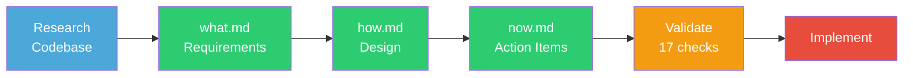
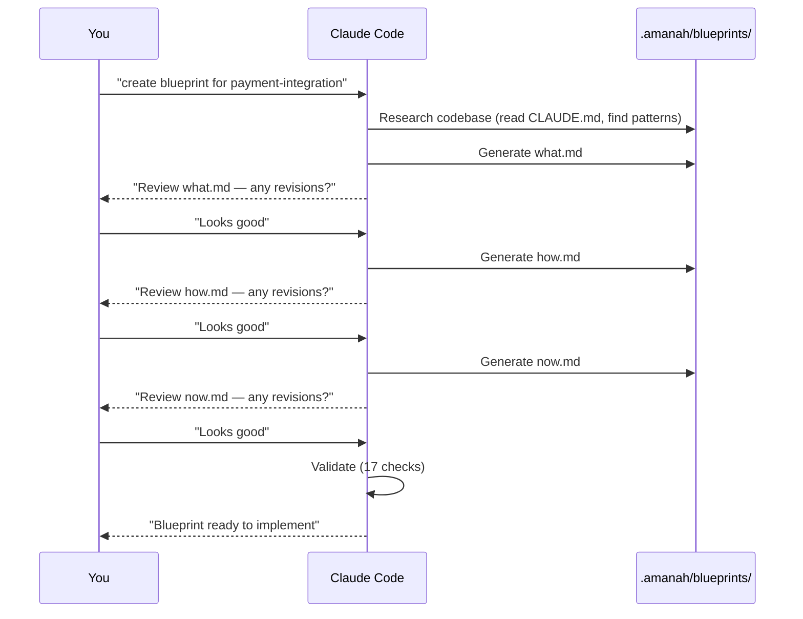
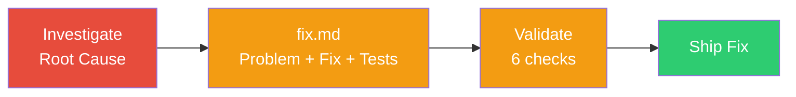
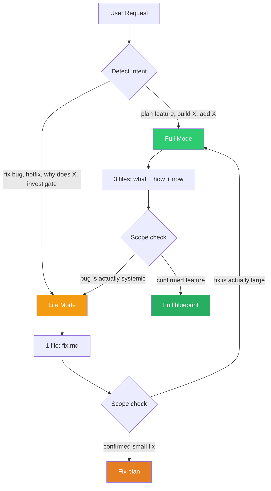
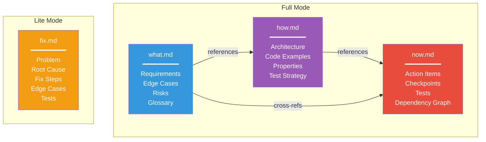
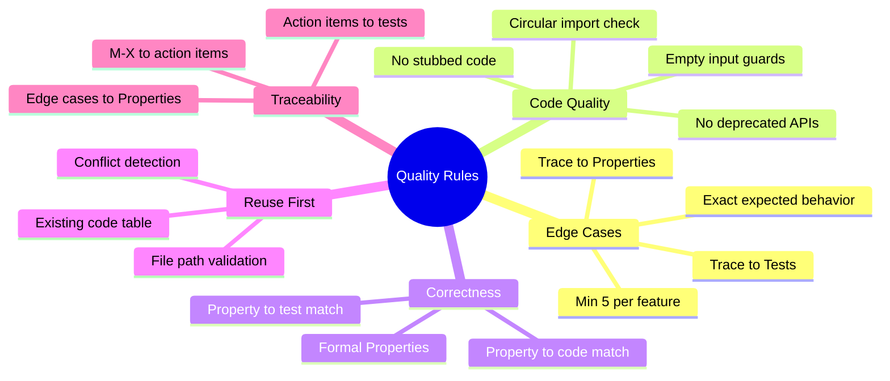
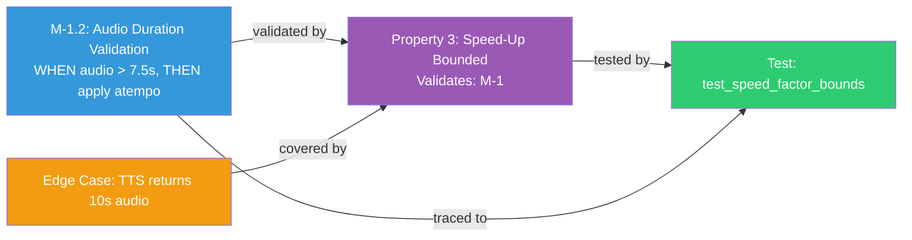

# Amanah Blueprint Generator


**Implementation-ready feature blueprints and bug fix plans for Claude Code.**

Stop guessing what to build. Generate structured specs that any developer (or AI) can implement without coming back to ask *"what did you mean?"*

---

## Why This Exists

Every team has the same problem: you describe a feature to an AI (or a junior dev), they build something, and it's **80% right**. Missing edge cases. Forgot error handling. Didn't check existing code. No tests for the tricky parts.

**This fixes that.** A structured blueprint format that forces thorough thinking BEFORE code is written.

| Without Blueprint | With Blueprint |
|---|---|
| AI writes plan from memory | AI reads YOUR code first, finds patterns |
| "Handle errors gracefully" | Error table: exact scenario, HTTP code, response, recovery |
| No edge cases | 5-10 edge cases with exact expected behavior |
| Hope it works | 17 validation checks before coding starts |
| "Write tests" | Property-based + unit + integration strategy |

---

## How It Works

### Full Mode (New Features)

Three files that work together:



```
.amanah/blueprints/{feature-name}/
├── what.md   WHAT to build (requirements, edge cases, risks)
├── how.md    HOW to build it (architecture, code, properties)
└── now.md    WHAT TO DO NOW (action items, tests, checkpoints)
```

**Sequential workflow — one file at a time, you review each before proceeding:**



### Lite Mode (Bug Fixes)

Single file, fast:



```
.amanah/blueprints/{bug-name}/
└── fix.md   Problem, root cause, fix steps, tests, risks
```

---

## Quick Start

### Install (60 seconds)


**Step 1** — Copy `.amanah/` to your project:

```bash
git clone https://github.com/nurulhadi/amanah-blueprint.git /tmp/abp
cp -r /tmp/abp/.amanah /path/to/your-project/
```

**Step 2** — Install the Claude Code skill + agent:

```bash
cd /path/to/your-project

mkdir -p .claude/skills/amanah-blueprint
cp .amanah/SKILL.md .claude/skills/amanah-blueprint/SKILL.md

cp .amanah/AGENT.md .claude/agents/amanah-blueprint-generator.agent.md
```

**Step 3** — Add to your project's `CLAUDE.md`:

```markdown
## Feature Blueprints

Blueprints live in `.amanah/blueprints/{feature-name}/`:
- `what.md` — What the feature must do
- `how.md` — How it's implemented
- `now.md` — Action items (implementation checklist)
- `fix.md` — Bug fix plans (Lite Mode)

**Always read these before modifying code for a feature.**
```

**Step 4** — Start using it:

```
create blueprint for user-authentication
```

---

## Mode Detection

The skill auto-detects which mode to use:



| Signal | Mode | Output | Time |
|--------|------|--------|------|
| "plan feature X", "build X", "add X" | Full | what + how + now | ~10 min |
| "fix bug X", "hotfix", "why does X" | Lite | fix.md | ~3 min |
| User says "lite" or "quick" | Lite | fix.md | ~3 min |
| User says "full" or "detailed" | Full | what + how + now | ~10 min |

---

## Usage Examples

### Full Mode

| You say | What happens |
|---------|-------------|
| `"create blueprint for user-authentication"` | Generates full what/how/now |
| `"plan a new feature for payment-integration"` | Researches codebase, generates blueprint |
| `"blueprint for notification-system"` | Full spec with edge cases, tests |
| `"update the how doc for notifications"` | Reads and edits existing blueprint |
| `"what's left to do?"` | Scans now.md for unchecked items |

### Lite Mode

| You say | What happens |
|---------|-------------|
| `"fix bug: audio cuts off in video"` | Investigates, generates fix.md |
| `"why does login fail on Safari?"` | Root cause analysis + fix plan |
| `"hotfix: payment amount wrong"` | Quick investigation + fix.md |
| `"investigate: API returns 500 on large payloads"` | Research, findings, fix steps |

---

## File Structure



### what.md Requirements

| Section | Purpose |
|---------|---------|
| **Overview** | What and why (1-2 paragraphs) |
| **Glossary** | Domain terms defined |
| **Must-Haves** (M-1, M-2...) | P0/P1/P2 priority, user stories, acceptance criteria |
| **Quality Targets** | Measurable: "95th percentile < 200ms" |
| **Risks & Mitigations** | What could go wrong in production |
| **Edge Cases** | 5-10 tricky scenarios with exact behavior |
| **Open Decisions** | Questions that block implementation |
| **Boundaries** | Constraints (no DB changes, etc.) |
| **Not Doing** | Explicitly excluded |

### how.md Design

| Section | Purpose |
|---------|---------|
| **Overview + Key Decisions** | WHY these design choices |
| **Architecture** | Mermaid sequence diagram |
| **Existing Code to Reuse** | Table of services/utils to leverage |
| **Components** | Full code examples with imports, type hints |
| **Data Models** | New + existing model changes |
| **Correctness Properties** | Formal statements linking to M-N |
| **Error Handling** | Scenario, HTTP code, Response, Recovery |
| **Testing Strategy** | Property-based + unit + integration |

### now.md Action Items

| Section | Purpose |
|---------|---------|
| **Action Items** | Numbered, exact file paths, method signatures |
| **Checkpoints** | Phase-gate validation between waves |
| **Tests** | Every Property and edge case has a test |
| **Dependency Graph** | JSON waves for parallelization |

### fix.md Bug Fix Plan

| Section | Purpose |
|---------|---------|
| **Problem** | What's broken (concrete example) |
| **Root Cause** | WHERE (file:line) and WHY |
| **Files Affected** | Table of changes |
| **Fix Steps** | Numbered, old code -> new code |
| **Edge Cases** | 3+ scenarios to verify |
| **Tests** | Fix test + regression test |
| **Risks** | What could go wrong with this fix |

---

## What Makes It "1 Hit" (No Revisions Needed)



17 validation checks run automatically after generation:

<details>
<summary><b>View all 17 validation checks</b></summary>

| # | Check | What it catches |
|---|-------|----------------|
| 1 | Cross-reference | Action items without requirements |
| 2 | Completeness | Requirements without action items |
| 3 | Consistency | how.md must-haves with no coverage |
| 4 | Naming | Non-kebab-case feature names |
| 5 | Properties check | Properties without M-N links |
| 6 | Testing coverage | Properties without tests |
| 7 | File path validation | Phantom file paths |
| 8 | Reuse check | Reuse table with fake paths |
| 9 | Conflict check | Multiple blueprints editing same files |
| 10 | Open Decisions | Unchecked questions blocking implementation |
| 11 | No stubbed code | `# ... same as current ...` shortcuts |
| 12 | No circular imports | Components importing from each other |
| 13 | No deprecated APIs | `get_event_loop()`, etc. |
| 14 | Property-code consistency | Property says X, code does Y |
| 15 | Test-Property coverage | Properties without corresponding tests |
| 16 | Edge case test coverage | Edge cases without tests |
| 17 | Function name consistency | `_private` vs `public` mismatches |

</details>

---

## Cross-Referencing System

Every item is numbered and linked. Nothing is orphaned.



```
what.md:  M-1.2  "WHEN audio > 7.5s, apply speed-up at min(1.3, duration/target)"
              ↓ validated by
how.md:   Property 3  "Speed factor SHALL NOT exceed 1.3"
              ↓ tested by
now.md:   Test 5.2  "Property test: speed factor within bounds, Hypothesis max_examples=50"
```

---

## Optional: Progress Tracking Hook

Add to `.claude/settings.json` to see blueprint progress in your terminal:

```json
{
  "hooks": {
    "PostToolUse": [
      {
        "matcher": "Write|Edit",
        "hooks": [
          {
            "type": "command",
            "command": "file=\"$TOOL_INPUT_FILE_PATH\"; if [ -n \"$file\" ] && echo \"$file\" | grep -qE '\\.amanah/blueprints/[^/]+/(what|how|now|fix)\\.md$'; then echo \"BLUEPRINT UPDATED: $file\"; if echo \"$file\" | grep -qE '(now|fix)\\.md$'; then checked=$(grep -c '\\- \\[x\\]' \"$file\" 2>/dev/null || echo 0); unchecked=$(grep -c '\\- \\[ \\]' \"$file\" 2>/dev/null || echo 0); total=$((checked + unchecked)); echo \"PROGRESS: $checked/$total done\"; fi; fi"
          }
        ]
      }
    ]
  }
}
```

**Output looks like:**
```
BLUEPRINT UPDATED: .amanah/blueprints/payment-integration/now.md
PROGRESS: 3/12 done
```

---

## Conventions

| Convention | Example |
|-----------|---------|
| Feature names are **kebab-case** | `user-authentication` |
| Items are numbered | `1`, `1.1`, `1.1.1` |
| Tasks start unchecked | `- [ ]` → `- [x]` when done |
| Action items ref requirements | `_Ref: M-3.1, M-3.4_` |
| Formal criteria language | `WHEN/THEN THE SYSTEM SHALL` |
| Every criterion has example | `WHEN balance=0.5, cost=1.0 → HTTP 402` |

---

## FAQ

<details>
<summary><b>Does this work with any tech stack?</b></summary>

Yes. The templates adapt to your stack. Python/FastAPI, TypeScript/Next.js, Go, Java, Ruby, PHP — the skill detects your stack from `CLAUDE.md`, `package.json`, `requirements.txt`, etc.

</details>

<details>
<summary><b>Can I use this without Claude Code?</b></summary>

The skill and agent files are designed for Claude Code. But the blueprint structure (what/how/now) is universal — you can use it with any AI or even write them manually as a team convention.

</details>

<details>
<summary><b>Does it modify my source code?</b></summary>

No. It only writes files to `.amanah/blueprints/`. Your source code is untouched.

</details>

<details>
<summary><b>What if I already have specs in another format?</b></summary>

The skill checks `.amanah/blueprints/` for existing specs and follows the same structure. You can migrate old specs incrementally — no big bang needed.

</details>

<details>
<summary><b>How is this different from GitHub Issues or Jira?</b></summary>

Issues/Jira **track** work. Blueprints **define** how to do the work. A blueprint is what you hand to a developer (or AI) so they can implement without guessing.

</details>

<details>
<summary><b>When should I use Full vs Lite Mode?</b></summary>

| Use Full Mode | Use Lite Mode |
|---|---|
| New feature | Bug fix |
| Touches >5 files | Touches ≤5 files |
| Needs architecture decisions | Root cause is clear |
| Multiple components | Single component |
| Needs stakeholder review | Just ship the fix |

The skill auto-detects and can escalate from Lite to Full if the bug turns out to be systemic.

</details>

---

## Repo Structure

```
.amanah/
├── README.md      This guide
├── LICENSE         MIT
├── .gitignore      Ignores generated blueprints/
├── SKILL.md        Skill template (what/how/now + fix.md templates, rules, validation)
├── AGENT.md        Agent template (research process, generation instructions)
└── blueprints/     Generated blueprints (project-specific, gitignored)
    └── {name}/
        ├── what.md
        ├── how.md
        ├── now.md
        └── fix.md
```

---

## License

MIT — Use it anywhere, no attribution required.

---

## Contributing

Found a gap? Have an improvement? PRs welcome.

1. Fork this repo
2. Make your changes to `SKILL.md` or `AGENT.md`
3. Test by generating a blueprint in a real project
4. Submit a PR explaining what improved and why
