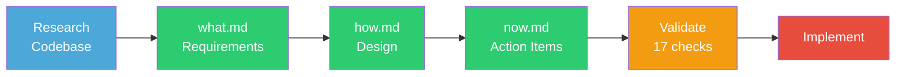
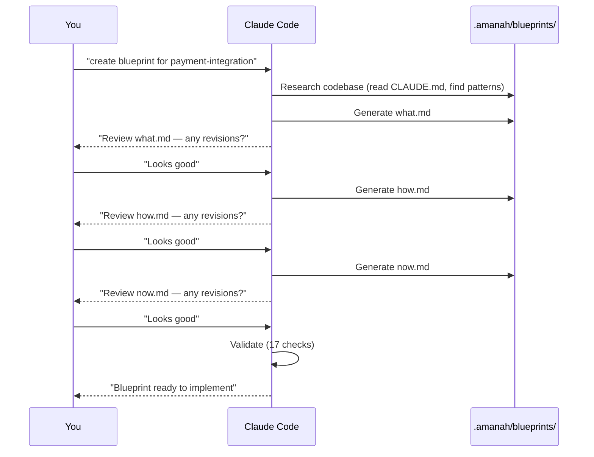
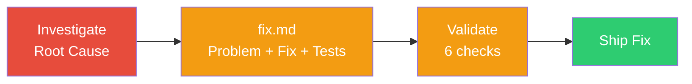
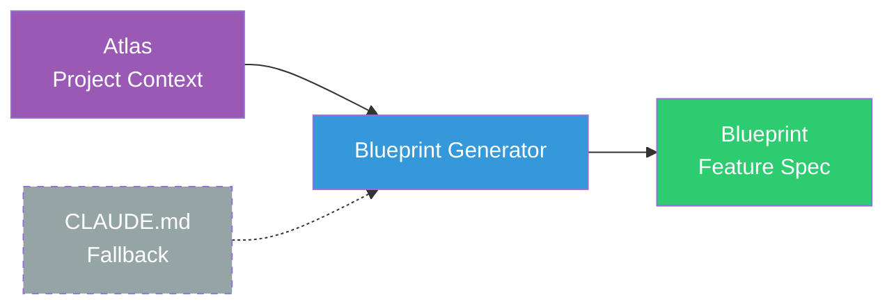
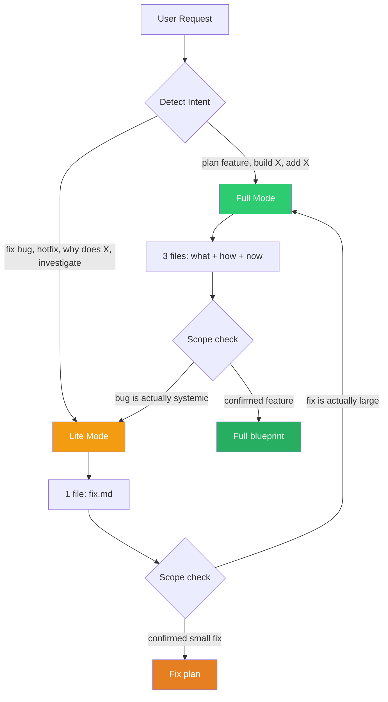
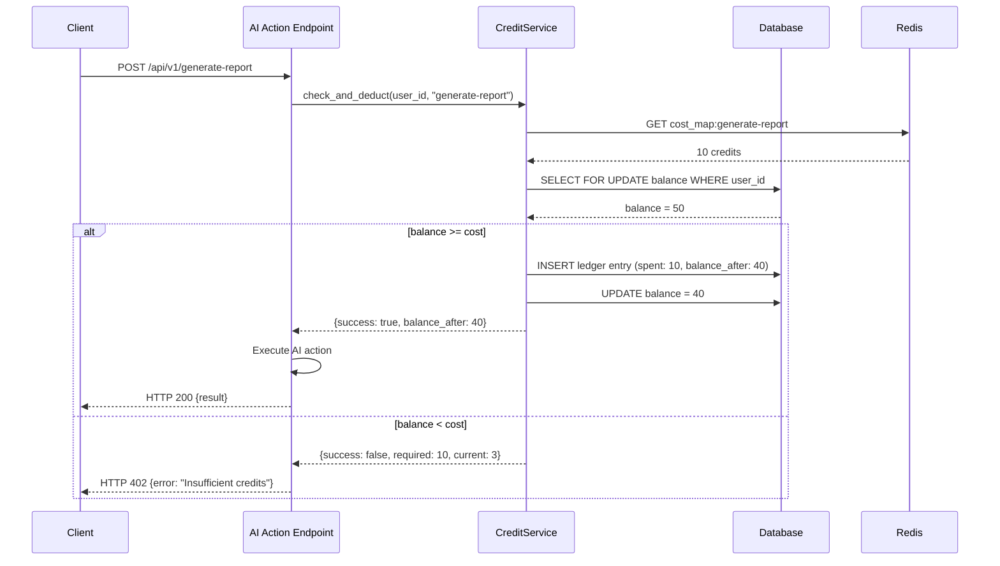
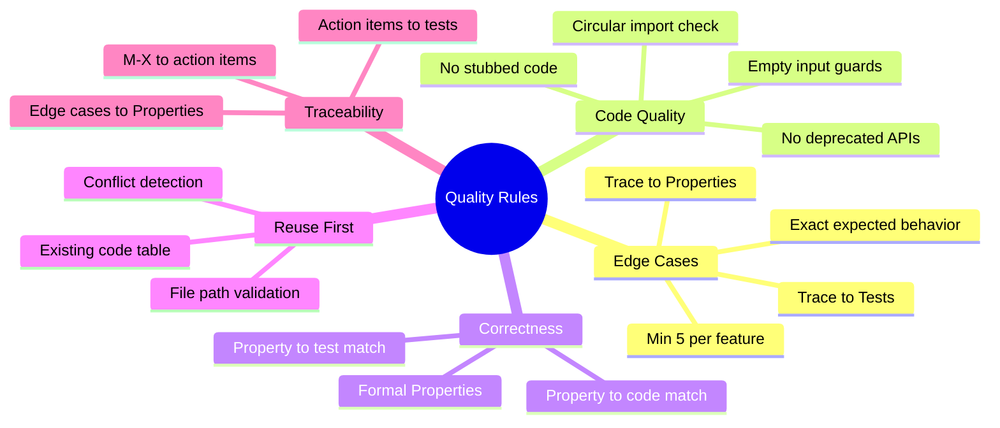
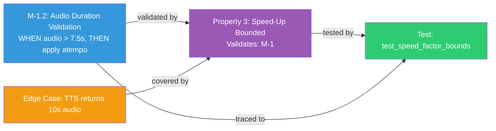
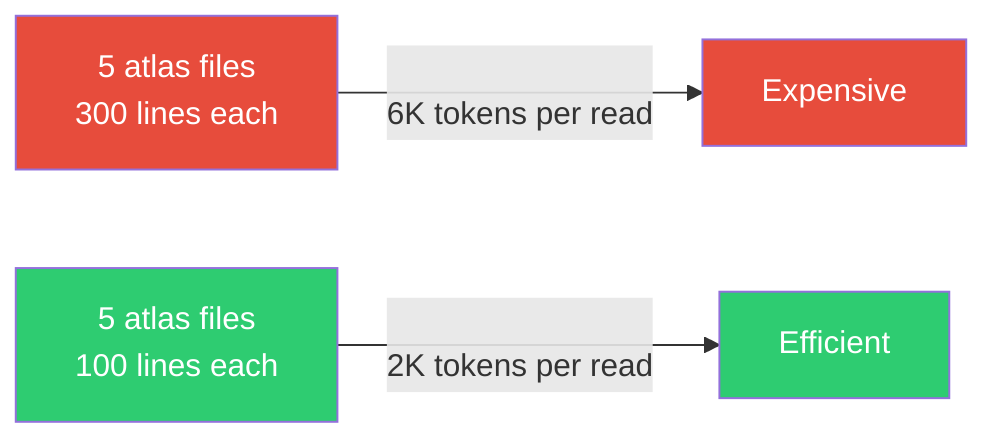

# Amanah Blueprint Generator


**Implementation-ready feature blueprints and bug fix plans for Claude Code.**

Stop guessing what to build. Generate structured specs that any developer (or AI) can implement without coming back to ask *"what did you mean?"*

---

## Why This Exists

Every team has the same problem: you describe a feature to an AI (or a junior dev), they build something, and it's **80% right**. Missing edge cases. Forgot error handling. Didn't check existing code. No tests for the tricky parts.

**This fixes that.** A structured blueprint format that forces thorough thinking BEFORE code is written.

| Without Blueprint | With Blueprint |
|---|---|
| AI writes plan from memory | AI reads YOUR code first, finds patterns |
| "Handle errors gracefully" | Error table: exact scenario, HTTP code, response, recovery |
| No edge cases | 5-10 edge cases with exact expected behavior |
| Hope it works | 17 validation checks before coding starts |
| "Write tests" | Property-based + unit + integration strategy |

---

## How It Works

### Full Mode (New Features)

Three files that work together:



```
.amanah/blueprints/{feature-name}/
├── what.md   WHAT to build (requirements, edge cases, risks)
├── how.md    HOW to build it (architecture, code, properties)
└── now.md    WHAT TO DO NOW (action items, tests, checkpoints)
```

**Sequential workflow — one file at a time, you review each before proceeding:**



### Lite Mode (Bug Fixes)

Single file, fast:



```
.amanah/blueprints/{bug-name}/
└── fix.md   Problem, root cause, fix steps, tests, risks
```

---

## Atlas — Project Context Maps

Blueprints are only as good as the project knowledge behind them. **Atlas** provides persistent project context that the generator reads BEFORE creating any blueprint.



### What Atlas Contains

```
.amanah/atlas/
├── product.md       Product landscape — what it is, who uses it
├── tech.md          Tech terrain — stack, libraries, databases
├── structure.md     Code map — directory layout, patterns
├── conventions.md   Rules of the land — gotchas, naming, do's/don'ts
└── quickstart.md    Trails to follow — common task recipes
```

| Map | Purpose | Blueprint Impact |
|-----|---------|-----------------|
| `product.md` | Domain concepts, user roles, business model | Glossary uses real terms, requirements match domain |
| `tech.md` | Stack, libraries, external services | Code examples use correct imports and SDKs |
| `structure.md` | Directory layout, code patterns, file locations | Action items reference real file paths |
| `conventions.md` | Gotchas, naming rules, import order | Generated code follows your standards |
| `quickstart.md` | Recipes for common tasks | Action items match your project's workflows |

### Without vs With Atlas

| Without Atlas | With Atlas |
|---|---|
| Generic code examples | Uses YOUR imports, YOUR patterns |
| Guesses file paths | References real file locations |
| May violate conventions | Follows your coding standards |
| Misses project-specific gotchas | Knows your edge cases upfront |
| Blueprint works for any project | Blueprint works for YOUR project |

### How to Set Up Atlas

**Option A: Auto-Generate (Recommended)**

The `amanah-atlas-generator` skill scans your codebase and generates all 5 atlas files with real content from your project:

```
generate atlas for this project
```

or

```
/atlas
```

The generator:
1. Detects your stack (Python, Node, Go, Java, etc.)
2. Reads CLAUDE.md, README, dependencies, config files
3. Scans directory structure and code patterns
4. Extracts conventions, gotchas, naming patterns
5. Generates 5 filled-in atlas files (no placeholders)

**Option B: Manual**

```bash
# Template files ship with .amanah/atlas/
# Edit them manually with your project's details

.amanah/atlas/
├── product.md       ← Edit: Your product overview
├── tech.md          ← Edit: Your stack details
├── structure.md     ← Edit: Your directory layout
├── conventions.md   ← Edit: Your coding rules
└── quickstart.md    ← Edit: Your common recipes
```

### Custom Maps

Beyond the 5 core maps, you can add **custom atlas files** for subsystem-specific deep dives:

```
.amanah/atlas/
├── product.md           # Core — auto-generated
├── tech.md              # Core — auto-generated
├── structure.md         # Core — auto-generated
├── conventions.md       # Core — auto-generated
├── quickstart.md        # Core — auto-generated
├── auth.md              # Custom — deep dive on authentication
├── payments.md          # Custom — payment integration details
├── pipeline.md          # Custom — data/message pipeline architecture
├── custom-objects.md    # Custom — subsystem documentation
└── {anything}.md        # Custom — whatever needs more context
```

The blueprint generator reads **ALL** `.md` files in `.amanah/atlas/` — core and custom alike. Add custom maps when a subsystem needs more context than the core maps provide.

**When to add custom maps:**
- A subsystem has its own architecture worth documenting (e.g., `pipeline-and-rag.md`)
- A domain has specific rules that don't fit in `conventions.md` (e.g., `auth.md`)
- An integration has its own gotchas and patterns (e.g., `payments.md`)

Atlas files are committed to your repo (not gitignored) — they're part of your project documentation, like `CLAUDE.md` but modular.

**No atlas?** The generator falls back to reading `CLAUDE.md` and `README.md`. Atlas is optional but recommended for better blueprints.

---

## Quick Start

### Install (60 seconds)


**Step 1** — Copy `.amanah/` to your project:

```bash
git clone https://github.com/nurulhadi/amanah-blueprint.git /tmp/abp
cp -r /tmp/abp/.amanah /path/to/your-project/
```

**Step 2** — Install the Claude Code skills + agent:

```bash
cd /path/to/your-project

# Blueprint generator skill + agent
mkdir -p .claude/skills/amanah-blueprint
cp .amanah/SKILL.md .claude/skills/amanah-blueprint/SKILL.md
cp .amanah/AGENT.md .claude/agents/amanah-blueprint-generator.agent.md

# Atlas generator skill
mkdir -p .claude/skills/amanah-atlas-generator
cp .amanah/atlas-generator/SKILL.md .claude/skills/amanah-atlas-generator/SKILL.md
```

**Step 3** — Generate your atlas (auto-scan your codebase):

```
# In Claude Code, just say:
generate atlas for this project
```

The atlas generator scans your code and fills in all 5 context maps automatically. Or edit `.amanah/atlas/*.md` manually if you prefer.

**Step 4** — Add to your project's `CLAUDE.md`:

```markdown
## Feature Blueprints

Blueprints live in `.amanah/blueprints/{feature-name}/`:
- `what.md` — What the feature must do
- `how.md` — How it's implemented
- `now.md` — Action items (implementation checklist)
- `fix.md` — Bug fix plans (Lite Mode)

**Always read these before modifying code for a feature.**
```

**Step 5** — Start using it:

```
create blueprint for user-authentication
```

---

## Mode Detection

The skill auto-detects which mode to use:



| Signal | Mode | Output | Time |
|--------|------|--------|------|
| "plan feature X", "build X", "add X" | Full | what + how + now | ~10 min |
| "fix bug X", "hotfix", "why does X" | Lite | fix.md | ~3 min |
| User says "lite" or "quick" | Lite | fix.md | ~3 min |
| User says "full" or "detailed" | Full | what + how + now | ~10 min |

---

## Usage Examples

### Full Mode

| You say | What happens |
|---------|-------------|
| `"create blueprint for user-authentication"` | Generates full what/how/now |
| `"plan a new feature for payment-integration"` | Researches codebase, generates blueprint |
| `"blueprint for notification-system"` | Full spec with edge cases, tests |
| `"update the how doc for notifications"` | Reads and edits existing blueprint |
| `"what's left to do?"` | Scans now.md for unchecked items |

### Lite Mode

| You say | What happens |
|---------|-------------|
| `"fix bug: audio cuts off in video"` | Investigates, generates fix.md |
| `"why does login fail on Safari?"` | Root cause analysis + fix plan |
| `"hotfix: payment amount wrong"` | Quick investigation + fix.md |
| `"investigate: API returns 500 on large payloads"` | Research, findings, fix steps |

---

## Blueprint Examples

See exactly what each file looks like. All examples use a fictional **credit-billing** feature.

### what.md — Requirements

<details>
<summary><b>📄 View what.md example</b></summary>

```markdown
# Credit Billing — What

## Overview

Credit-based billing for AI features. Users purchase credits, each AI action costs
a specific amount. Prevents unexpected charges and enables pay-as-you-go pricing.

## Glossary

- **Credit**: Virtual currency, 1 credit = $0.01. Deducted per AI action.
- **Credit Balance**: User's current credit count. Must be > 0 to use AI features.
- **Cost Map**: Lookup table mapping AI actions to credit costs.

## Must-Haves

### M-1: Credit Deduction on AI Action
- **Priority**: P0 (must)
- **User Story:** As a user, I want to see exactly how many credits each AI action
  costs before it runs, so that I'm never surprised by charges.

#### Acceptance Criteria
1. WHEN an AI action is requested, THE system SHALL check the user's credit balance
   against the action's cost BEFORE executing.
   - Example: User has 50 credits, requests "generate-report" (cost: 10 credits)
     → system allows action, deducts 10 credits, new balance: 40.

2. IF the credit balance is less than the action cost, THEN THE system SHALL reject
   the request with HTTP 402 and a clear error message.
   - Example: User has 3 credits, requests "generate-report" (cost: 10) → HTTP 402
     {required_credits: 10, current_balance: 3, message: "Insufficient credits"}

3. WHEN credits are deducted, THE system SHALL create an immutable ledger entry with
   user_id, action_type, credits_spent, balance_after, and timestamp.
   - Example: After deduction → ledger entry {user: "abc-123", action: "generate-report",
     spent: 10, balance_after: 40, timestamp: "2026-06-01T12:00:00Z"}

### M-2: Credit Purchase
- **Priority**: P0 (must)
- **User Story:** As a user, I want to purchase credits via Stripe, so that I can
  continue using AI features when my balance runs low.

#### Acceptance Criteria
1. WHEN a purchase is completed via Stripe webhook, THE system SHALL add credits
   to the user's balance within 5 seconds.
   - Example: Stripe webhook confirms $10 payment → add 1000 credits → log in ledger.

2. THE system SHALL NOT add credits until the Stripe webhook confirms `payment_succeeded`.
   - Example: User closes browser mid-checkout → no credits added until webhook fires.

## Quality Targets

### Q-1: Performance
- **Target**: Credit check adds <50ms to AI action response time.

### Q-2: Consistency
- **Target**: Credit balance SHALL never go negative. 100% guarantee, no exceptions.

## Risks & Mitigations

| Risk | Impact | Likelihood | Mitigation |
|------|--------|------------|------------|
| Concurrent requests both pass balance check, both deduct | High — user goes negative | Medium | Use SELECT FOR UPDATE on balance row, retry on conflict |
| Stripe webhook fires twice (retry) | Medium — double credits added | Low | Idempotency key from Stripe event_id |
| Cost map misconfigured (wrong price) | High — over/under charge | Low | Cost map loaded from DB, cached, with admin override audit log |

## Edge Cases

| Scenario | Expected Behavior | Why It's Tricky |
|----------|-------------------|-----------------|
| User has exactly 0 credits | Block AI action, show purchase prompt | Off-by-one: is 0 "positive"? No. |
| Concurrent requests for same user | Serialize via row lock, second request sees updated balance | Race condition between check and deduct |
| Stripe webhook timeout | Don't add credits. Log for manual reconciliation. | Network failures cause silent data loss |
| Refund after credits already spent | Mark ledger entries as "refunded", don't claw back spent credits | Accounting: do we owe the user? |
| User downgrades plan mid-month | Keep existing credits, no proration on credits | Subscription vs credits are separate concerns |
| Cost map changes while request in-flight | Use cost at request start time, not at completion | Race between config update and deduction |

## Open Decisions

- [ ] Should credits expire after 12 months? — Decided by: Product team
- [ ] Allow negative balance with warning? Or hard block? — Decided by: Product team, option: hard block (simpler)

## Boundaries
- No changes to existing Stripe integration
- Must work with existing user auth system

## Not Doing
- Subscription tiers (separate feature)
- Credit transfers between users
- Refund processing (manual via admin panel)

## Depends On
- Existing Stripe webhook handler
- Existing user authentication

## Revision Log

| Date | What Changed | Why |
|------|-------------|-----|
| 2026-06-01 | Initial creation | Feature request from product team |
```

</details>

### how.md — Design

<details>
<summary><b>📄 View how.md example</b></summary>

```markdown
# Credit Billing — How

## Overview

Credit check and deduction via a dedicated service layer. Uses database row-level
locking (SELECT FOR UPDATE) to prevent race conditions on concurrent requests.

**Key Design Decisions:**
- **Row-level locking over application-level mutexes**: Database locks are simpler,
  survive crashes, and work across multiple server instances.
- **Immutable ledger over mutable balance column**: Every transaction is recorded.
  Balance is derived from ledger, not stored directly (audit-friendly).
- **Cost map from DB, cached in Redis**: Allows admin updates without deploys.
  Cache TTL: 5 min. Fallback to DB if Redis is down.

## Architecture



## Components and Interfaces

### Existing Code to Reuse

| What | File Path | How to Reuse |
|------|-----------|-------------|
| `StripeWebhookHandler` | `services/payment/stripe_webhook.py` | Existing webhook handler. Add credit top-up on `payment_succeeded` event. |
| `UserModel` | `models/user.py` | Has `id`, `email`, `tenant_id`. Add `credit_balance` column. |
| `get_current_user` | `api/dependencies/auth.py` | Existing auth dependency. Use in endpoints that need credit check. |

### 1. CreditService (`services/billing/credit_service.py`)

```python
from typing import Optional
from uuid import UUID
from sqlalchemy.ext.asyncio import AsyncSession
from sqlalchemy import text

class CreditService:
    """Check and deduct credits for AI actions. Thread-safe via row locking."""

    @staticmethod
    async def check_and_deduct(
        db: AsyncSession,
        user_id: UUID,
        action: str,
    ) -> dict:
        """
        Check if user has enough credits and deduct if so.

        Returns:
            {success: bool, balance_after: int, required: int, current: int}
        """
        # 0. Guard: validate inputs
        if not user_id or not action:
            return {"success": False, "error": "Invalid input"}

        # 1. Get cost from Redis cache (fallback to DB)
        cost = await CreditService._get_action_cost(db, action)
        if cost is None:
            return {"success": False, "error": "Unknown action"}

        # 2. Lock user row and check balance
        result = await db.execute(
            text("SELECT credit_balance FROM users WHERE id = :uid FOR UPDATE"),
            {"uid": user_id},
        )
        balance = result.scalar_one_or_none()
        if balance is None:
            return {"success": False, "error": "User not found"}

        # 3. Check sufficient credits
        if balance < cost:
            return {
                "success": False,
                "required": cost,
                "current": balance,
            }

        # 4. Deduct and create ledger entry
        new_balance = balance - cost
        await db.execute(
            text("UPDATE users SET credit_balance = :bal WHERE id = :uid"),
            {"bal": new_balance, "uid": user_id},
        )
        await db.execute(
            text("""INSERT INTO credit_ledger
                (user_id, action, credits_spent, balance_after)
                VALUES (:uid, :action, :cost, :bal)"""),
            {"uid": user_id, "action": action, "cost": cost, "bal": new_balance},
        )
        await db.commit()

        return {"success": True, "balance_after": new_balance}
```

## Correctness Properties

### Property 1: Balance Never Negative
*For any* sequence of concurrent credit deductions, the user's balance SHALL never
go below 0.
**Validates: M-1, Q-2**
**Edge cases covered**: "Concurrent requests for same user", "User has exactly 0 credits"

### Property 2: Cost is Consistent
*For any* AI action A, the cost charged SHALL be the cost that was in effect at
the time of the request, even if the cost map changes mid-request.
**Validates: M-1**
**Edge cases covered**: "Cost map changes while request in-flight"

## Error Handling

| Scenario | HTTP Code | Response Body | Recovery |
|----------|-----------|---------------|----------|
| Insufficient credits | 402 | `{required: 10, current: 3, message: "Insufficient credits"}` | User purchases credits |
| Unknown action type | 400 | `{error: "Unknown action: foo"}` | Developer fixes action name |
| Database lock timeout | 503 | `{error: "Service busy, retry"}` | Client retries with backoff |
| Stripe webhook duplicate | 200 | `{status: "already_processed"}` | None needed |

## Testing Strategy

### Property-Based Tests
- **Balance never negative**: Generate random sequences of (user_balance, cost) pairs.
  Verify that `check_and_deduct` never returns `success: true` when `balance < cost`.
  Library: Hypothesis, `max_examples=500`.
- **Ledger consistency**: For any sequence of deductions, verify `sum(spent) + current_balance == initial_balance`.

### Unit Tests
- `check_and_deduct()` — balance exactly equals cost → success, balance becomes 0
- `check_and_deduct()` — balance 1 less than cost → failure with correct values
- `check_and_deduct()` — concurrent simulation with 10 threads, balance 100, cost 10
  → exactly 10 succeed, 0 fail, final balance 0

### Integration Tests
- Full flow: purchase credits via Stripe mock → check balance → deduct → verify ledger
- Concurrent: 5 simultaneous requests, balance 30, cost 10 → exactly 3 succeed

## Revision Log

| Date | What Changed | Why |
|------|-------------|-----|
| 2026-06-01 | Initial creation | Feature request |
```

</details>

### now.md — Action Items

<details>
<summary><b>📄 View now.md example</b></summary>

```markdown
# Credit Billing — Now

## Overview

Implement credit-based billing with row-level locking, immutable ledger, and
Stripe top-up integration.

## Action Items

- [ ] 1. Database: Create ledger table and add balance column
  - [ ] 1.1 Create Alembic migration `add_credit_billing`
    - Add `credit_balance INTEGER NOT NULL DEFAULT 0` to `users` table
    - Create `credit_ledger` table:
      - `id UUID PRIMARY KEY`
      - `user_id UUID FK(users.id) NOT NULL`
      - `action VARCHAR(100) NOT NULL`
      - `credits_spent INTEGER NOT NULL`
      - `balance_after INTEGER NOT NULL`
      - `created_at TIMESTAMPTZ NOT NULL DEFAULT NOW()`
    - Add index on `credit_ledger(user_id, created_at DESC)`
    - _Ref: M-1.3_

  - [ ] 1.2 Create cost map table
    - Create `credit_cost_map` table:
      - `action VARCHAR(100) PRIMARY KEY`
      - `cost INTEGER NOT NULL`
      - `updated_at TIMESTAMPTZ NOT NULL DEFAULT NOW()`
    - Seed with: `generate-report: 10, summarize: 5, translate: 3`
    - _Ref: M-2.1_

- [ ] 2. Checkpoint — Database ready
  - Run migration: `alembic upgrade head`
  - Verify tables exist with `\dt credit_ledger credit_cost_map`
  - Verify seed data: `SELECT * FROM credit_cost_map`

- [ ] 3. Service layer: Build CreditService
  - [ ] 3.1 Create `services/billing/credit_service.py`
    - Define `CreditService.check_and_deduct(db, user_id, action) -> dict`
    - Use `SELECT FOR UPDATE` for row locking
    - Insert ledger entry on every deduction
    - Return `{success, balance_after}` or `{success: false, required, current}`
    - _Ref: M-1.1, M-1.2, M-1.3_

  - [ ] 3.2 Create `services/billing/cost_map.py`
    - Redis-cached cost lookup with 5-min TTL
    - Fallback to DB if Redis is down
    - `async def get_cost(db, action) -> Optional[int]`
    - _Ref: M-1.1_

- [ ] 4. Checkpoint — Service layer ready
  - Unit test: `CreditService.check_and_deduct()` with mock DB
  - Verify row locking works under concurrent access

- [ ] 5. API: Add credit check to AI endpoints
  - [ ] 5.1 Add credit check decorator to `api/v1/ai/generate_report.py`
    - Before executing AI logic, call `CreditService.check_and_deduct()`
    - If `success: false` → return HTTP 402 with error body
    - _Ref: M-1.1, M-1.2_

- [ ] 6. Stripe: Add credit top-up on payment success
  - [ ] 6.1 Modify `services/payment/stripe_webhook.py`
    - On `payment_succeeded` event: add credits based on amount
    - Use idempotency key from Stripe event_id
    - _Ref: M-2.1, Property: Stripe webhook duplicate_

- [ ] 7. Checkpoint — Integration complete
  - Manual test: purchase credits → verify balance updated
  - Manual test: AI action → verify deduction
  - Manual test: insufficient credits → verify HTTP 402

- [ ] 8. Tests: Unit + Property-based
  - [ ] 8.1 Create `tests/unit/test_credit_service.py`
    - Test: balance == cost → success, balance becomes 0
    - Test: balance < cost → failure with correct values
    - Test: unknown action → error
    - _Ref: M-1.1_

  - [ ] 8.2 Create `tests/property/test_credit_properties.py`
    - Property: balance never negative (Hypothesis, max_examples=500)
    - Property: ledger consistency (sum + balance == initial)
    - _Ref: Property 1, Property 2_

  - [ ] 8.3 Create `tests/integration/test_credit_billing.py`
    - Full flow: Stripe mock → top-up → deduct → verify ledger
    - Concurrent: 5 threads, balance 30, cost 10 → exactly 3 succeed
    - _Ref: M-1.1, M-2.1_

- [ ] 9. Final checkpoint — All tests pass
  - `pytest tests/ -k credit -v`
  - Verify no regressions: `pytest tests/ -v`

## Notes
- **Row locking**: PostgreSQL SELECT FOR UPDATE is critical. Without it, concurrent
  requests could both read balance=50, both deduct, resulting in balance=-10.
- **Idempotency**: Stripe can send the same webhook twice. Always check if the
  event_id has been processed before adding credits.
- **Migration safety**: Adding `credit_balance` with DEFAULT 0 is safe for existing
  rows. No backfill needed.

## Dependency Graph

```json
{
  "waves": [
    { "id": 0, "tasks": ["1.1", "1.2"] },
    { "id": 1, "tasks": ["3.1", "3.2"] },
    { "id": 2, "tasks": ["5.1", "6.1"] },
    { "id": 3, "tasks": ["8.1", "8.2", "8.3"] }
  ]
}
```

## Revision Log

| Date | What Changed | Why |
|------|-------------|-----|
| 2026-06-01 | Initial creation | Feature request |
```

</details>

### fix.md — Bug Fix (Lite Mode)

<details>
<summary><b>📄 View fix.md example</b></summary>

```markdown
# Login Fails on Safari — Fix

## Problem

Users on Safari 17+ report that login button does nothing after clicking. No error
in UI, no network request in browser DevTools. Works fine on Chrome and Firefox.

Concrete example: User enters email + password, clicks "Sign In", button highlights
but nothing happens. Console shows: `TypeError: crypto.randomUUID is not a function`.

## Root Cause

`auth/utils.py:45` uses `crypto.randomUUID()` to generate request IDs. Safari 17.0
removed this from the `crypto` object (re-added in 17.1, but many users haven't updated).

The function throws, the error is silently caught by a try/catch in the form handler
that doesn't display anything to the user.

## Files Affected

| File | Change Type | What Changes |
|------|------------|--------------|
| `frontend/src/auth/utils.ts` | Modify | Add UUID fallback for Safari |
| `frontend/src/auth/LoginForm.tsx` | Modify | Show error to user instead of silent catch |

## Fix Steps

- [ ] 1. Add UUID fallback in `frontend/src/auth/utils.ts`
  - Line 45: Replace `crypto.randomUUID()` with `generateUUID()` helper
  - Add helper function:
    ```typescript
    function generateUUID(): string {
      if (typeof crypto !== 'undefined' && crypto.randomUUID) {
        return crypto.randomUUID();
      }
      // Fallback for older Safari/Edge
      return 'xxxxxxxx-xxxx-4xxx-yxxx-xxxxxxxxxxxx'.replace(/[xy]/g, (c) => {
        const r = Math.random() * 16 | 0;
        const v = c === 'x' ? r : (r & 0x3 | 0x8);
        return v.toString(16);
      });
    }
    ```
  - _Refs: Issue #234, Safari 17.0 release notes_

- [ ] 2. Fix silent error catch in `frontend/src/auth/LoginForm.tsx`
  - Line 23: Replace `catch (e) { console.error(e) }` with
    `catch (e) { setError(e.message || "Login failed. Please try again.") }`
  - This ensures ANY future auth error is visible to the user

## Edge Cases to Verify

| Scenario | Expected After Fix | How to Test |
|----------|-------------------|-------------|
| Safari 17.0 (affected version) | Login works, UUID generated via fallback | BrowserStack Safari 17.0 |
| Safari 17.1+ (fixed version) | Login works, uses native `randomUUID()` | BrowserStack Safari 17.4 |
| Other browsers (Chrome, Firefox, Edge) | Unchanged — still works | Manual testing |
| Error thrown during login (any error) | User sees error message, not blank screen | Simulate network error |

## Tests

- [ ] Unit test: `generateUUID()` returns valid UUID format `xxx-xxx-xxx-xxx-xxx`
- [ ] Unit test: `generateUUID()` works when `crypto.randomUUID` is undefined
- [ ] Regression test: existing Chrome login test still passes

## Risks

| Risk | Mitigation |
|------|-----------|
| Fallback UUID has collision chance (Math.random) | Acceptable for request IDs, not for primary keys. Add comment. |
| Users don't refresh browser, cached JS still broken | Deploy as hotfix, ask users to hard-refresh (Ctrl+Shift+R) |

## Notes
- Same pattern may exist in `frontend/src/api/client.ts` — check if it uses `randomUUID`
- Consider adding a polyfill package (`uuid` npm package) for project-wide consistency

## Revision Log

| Date | What Changed | Why |
|------|-------------|-----|
| 2026-06-01 | Initial creation | Bug report: Safari login fails |
```

</details>

---

## File Reference

### what.md — Requirements

| Section | Purpose |
|---------|---------|
| **Overview** | What and why (1-2 paragraphs) |
| **Glossary** | Domain terms defined |
| **Must-Haves** (M-1, M-2...) | P0/P1/P2 priority, user stories, acceptance criteria |
| **Quality Targets** | Measurable: "95th percentile < 200ms" |
| **Risks & Mitigations** | What could go wrong in production |
| **Edge Cases** | 5-10 tricky scenarios with exact behavior |
| **Open Decisions** | Questions that block implementation |
| **Boundaries** | Constraints (no DB changes, etc.) |
| **Not Doing** | Explicitly excluded |

### how.md — Design

| Section | Purpose |
|---------|---------|
| **Overview + Key Decisions** | WHY these design choices |
| **Architecture** | Mermaid sequence diagram |
| **Existing Code to Reuse** | Table of services/utils to leverage |
| **Components** | Full code examples with imports, type hints |
| **Data Models** | New + existing model changes |
| **Correctness Properties** | Formal statements linking to M-N |
| **Error Handling** | Scenario, HTTP code, Response, Recovery |
| **Testing Strategy** | Property-based + unit + integration |

### now.md — Action Items

| Section | Purpose |
|---------|---------|
| **Action Items** | Numbered, exact file paths, method signatures |
| **Checkpoints** | Phase-gate validation between waves |
| **Tests** | Every Property and edge case has a test |
| **Dependency Graph** | JSON waves for parallelization |

### fix.md — Bug Fix Plan

| Section | Purpose |
|---------|---------|
| **Problem** | What's broken (concrete example) |
| **Root Cause** | WHERE (file:line) and WHY |
| **Files Affected** | Table of changes |
| **Fix Steps** | Numbered, old code → new code |
| **Edge Cases** | 3+ scenarios to verify |
| **Tests** | Fix test + regression test |
| **Risks** | What could go wrong with this fix |

---

## What Makes It "1 Hit" (No Revisions Needed)



17 validation checks run automatically after generation:

<details>
<summary><b>View all 17 validation checks</b></summary>

| # | Check | What it catches |
|---|-------|----------------|
| 1 | Cross-reference | Action items without requirements |
| 2 | Completeness | Requirements without action items |
| 3 | Consistency | how.md must-haves with no coverage |
| 4 | Naming | Non-kebab-case feature names |
| 5 | Properties check | Properties without M-N links |
| 6 | Testing coverage | Properties without tests |
| 7 | File path validation | Phantom file paths |
| 8 | Reuse check | Reuse table with fake paths |
| 9 | Conflict check | Multiple blueprints editing same files |
| 10 | Open Decisions | Unchecked questions blocking implementation |
| 11 | No stubbed code | `# ... same as current ...` shortcuts |
| 12 | No circular imports | Components importing from each other |
| 13 | No deprecated APIs | `get_event_loop()`, etc. |
| 14 | Property-code consistency | Property says X, code does Y |
| 15 | Test-Property coverage | Properties without corresponding tests |
| 16 | Edge case test coverage | Edge cases without tests |
| 17 | Function name consistency | `_private` vs `public` mismatches |

</details>

---

## Cross-Referencing System

Every item is numbered and linked. Nothing is orphaned.



```
what.md:  M-1.2  "WHEN audio > 7.5s, apply speed-up at min(1.3, duration/target)"
              ↓ validated by
how.md:   Property 3  "Speed factor SHALL NOT exceed 1.3"
              ↓ tested by
now.md:   Test 5.2  "Property test: speed factor within bounds, Hypothesis max_examples=50"
```

---

## Optional: Progress Tracking Hook

Add to `.claude/settings.json` to see blueprint progress in your terminal:

```json
{
  "hooks": {
    "PostToolUse": [
      {
        "matcher": "Write|Edit",
        "hooks": [
          {
            "type": "command",
            "command": "file=\"$TOOL_INPUT_FILE_PATH\"; if [ -n \"$file\" ] && echo \"$file\" | grep -qE '\\.amanah/blueprints/[^/]+/(what|how|now|fix)\\.md$'; then echo \"BLUEPRINT UPDATED: $file\"; if echo \"$file\" | grep -qE '(now|fix)\\.md$'; then checked=$(grep -c '\\- \\[x\\]' \"$file\" 2>/dev/null || echo 0); unchecked=$(grep -c '\\- \\[ \\]' \"$file\" 2>/dev/null || echo 0); total=$((checked + unchecked)); echo \"PROGRESS: $checked/$total done\"; fi; fi"
          }
        ]
      }
    ]
  }
}
```

**Output looks like:**
```
BLUEPRINT UPDATED: .amanah/blueprints/payment-integration/now.md
PROGRESS: 3/12 done
```

---

## Conventions

| Convention | Example |
|-----------|---------|
| Feature names are **kebab-case** | `user-authentication` |
| Items are numbered | `1`, `1.1`, `1.1.1` |
| Tasks start unchecked | `- [ ]` → `- [x]` when done |
| Action items ref requirements | `_Ref: M-3.1, M-3.4_` |
| Formal criteria language | `WHEN/THEN THE SYSTEM SHALL` |
| Every criterion has example | `WHEN balance=0.5, cost=1.0 → HTTP 402` |

---

## Token Optimization

Blueprints can be token-heavy. Here's how to minimize cost without sacrificing quality.

### Estimated Token Cost

| Task | Tokens | When |
|------|--------|------|
| 1 Lite fix (fix.md) | ~5-8K | Bug fix, small change |
| 1 Full blueprint (what+how+now) | ~20-30K | New feature |
| 2 Full blueprints (batched) | ~40K | Multiple features, same session |
| 1 Full + 2 Lite (batched) | ~35K | Mixed, same session |
| Atlas regeneration | ~15K | First-time setup |

### Quick Wins (Biggest Impact)

| Tip | Savings | How |
|-----|---------|-----|
| **Keep atlas files short** (<120 lines each) | ~3-4K per blueprint | Dense, useful, no fluff |
| **Use Lite Mode for ≤5 file changes** | ~20K per blueprint | `fix.md` instead of full what/how/now |
| **Batch blueprints in one session** | ~5K per additional blueprint | Atlas stays in context, no re-read |
| **Targeted updates** instead of full regen | ~15K | Edit affected section only |
| **Skip reviews for small features** | ~3-5K | `"generate all 3, skip reviews"` |

### Atlas Optimization



**Rules:**
- Each atlas file should be **80-120 lines** — dense, no filler
- Generator only reads **relevant atlas files** (skip `product.md` for pure DB changes)
- Atlas stays in context **within a session** — multiple blueprints share the same read

### Batch Blueprints

```
❌ EXPENSIVE: New session for each blueprint
Session 1: create blueprint for feature-A  → reads atlas (5K)
Session 2: create blueprint for feature-B  → reads atlas (5K again)
Session 3: create blueprint for feature-C  → reads atlas (5K again)
                                         Total atlas reads: 15K tokens

✅ EFFICIENT: Multiple blueprints in one session
Session 1: create blueprint for A, then B, then C
                                         Total atlas reads: 5K tokens
                                         Savings: 10K tokens
```

---

## FAQ

<details>
<summary><b>Does this work with any tech stack?</b></summary>

Yes. The templates adapt to your stack. Python/FastAPI, TypeScript/Next.js, Go, Java, Ruby, PHP — the skill detects your stack from `CLAUDE.md`, `package.json`, `requirements.txt`, etc.

</details>

<details>
<summary><b>Can I use this without Claude Code?</b></summary>

The skill and agent files are designed for Claude Code. But the blueprint structure (what/how/now) is universal — you can use it with any AI or even write them manually as a team convention.

</details>

<details>
<summary><b>Does it modify my source code?</b></summary>

No. It only writes files to `.amanah/blueprints/`. Your source code is untouched.

</details>

<details>
<summary><b>What if I already have specs in another format?</b></summary>

The skill checks `.amanah/blueprints/` for existing specs and follows the same structure. You can migrate old specs incrementally — no big bang needed.

</details>

<details>
<summary><b>How is this different from GitHub Issues or Jira?</b></summary>

Issues/Jira **track** work. Blueprints **define** how to do the work. A blueprint is what you hand to a developer (or AI) so they can implement without guessing.

</details>

<details>
<summary><b>When should I use Full vs Lite Mode?</b></summary>

| Use Full Mode | Use Lite Mode |
|---|---|
| New feature | Bug fix |
| Touches >5 files | Touches ≤5 files |
| Needs architecture decisions | Root cause is clear |
| Multiple components | Single component |
| Needs stakeholder review | Just ship the fix |

The skill auto-detects and can escalate from Lite to Full if the bug turns out to be systemic.

</details>

---

## Repo Structure

```
.amanah/
├── README.md           This guide
├── LICENSE              MIT
├── .gitignore           Ignores generated blueprints/
├── SKILL.md             Blueprint skill template (v5.0.0 — atlas-aware + lite mode)
├── AGENT.md             Blueprint agent template (v5.0.0 — atlas-aware research phase)
├── atlas-generator/     Atlas generator skill (auto-generates atlas from codebase)
│   └── SKILL.md
├── atlas/               Project context maps (5 core templates + custom maps)
│   ├── product.md
│   ├── tech.md
│   ├── structure.md
│   ├── conventions.md
│   ├── quickstart.md
│   └── {custom}.md      Optional: subsystem deep dives
└── blueprints/          Generated blueprints (project-specific, gitignored)
    └── {name}/
        ├── what.md
        ├── how.md
        ├── now.md
        └── fix.md
```

---

## License

MIT — Use it anywhere, no attribution required.

---

## Contributing

Found a gap? Have an improvement? PRs welcome.

1. Fork this repo
2. Make your changes to `SKILL.md` or `AGENT.md`
3. Test by generating a blueprint in a real project
4. Submit a PR explaining what improved and why
