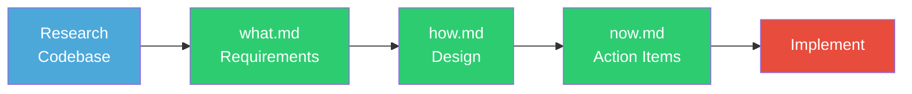
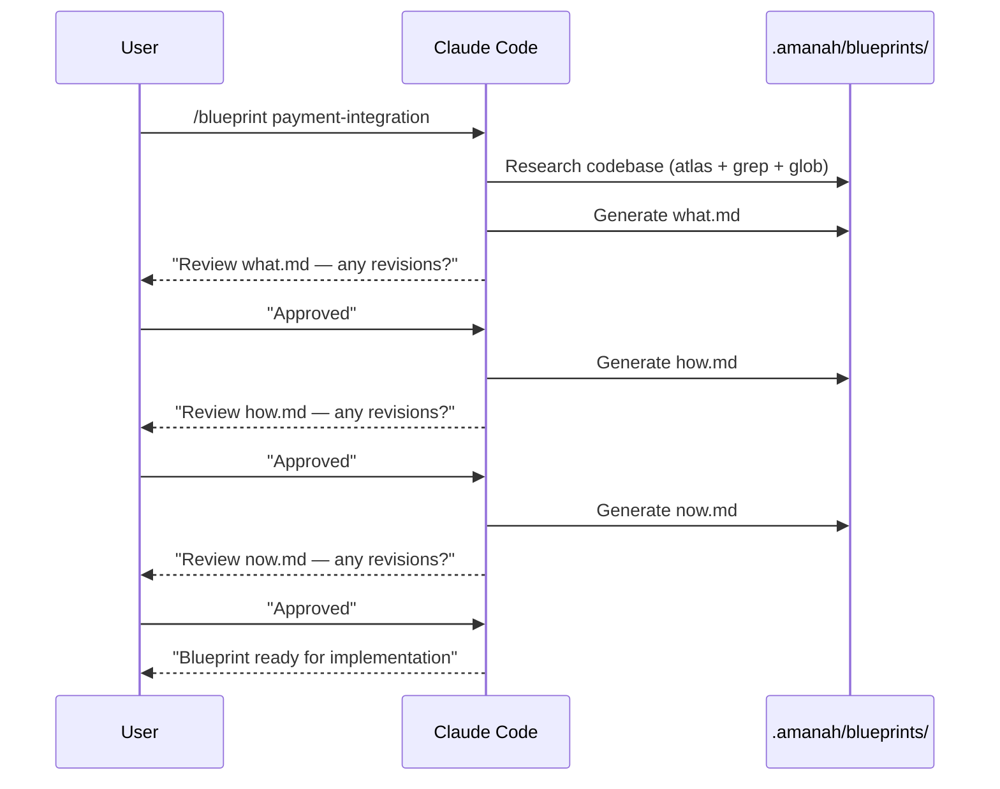
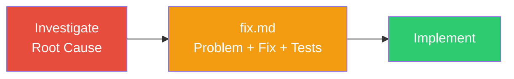
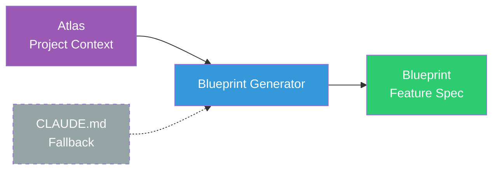
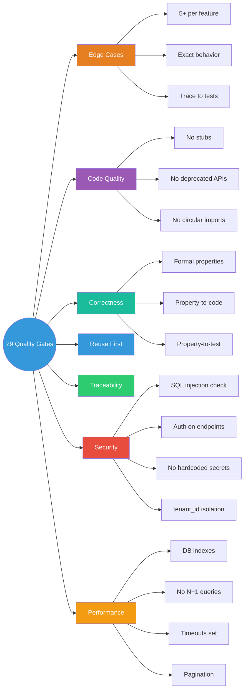
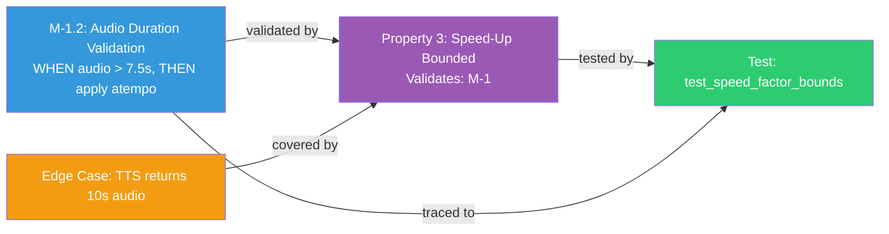
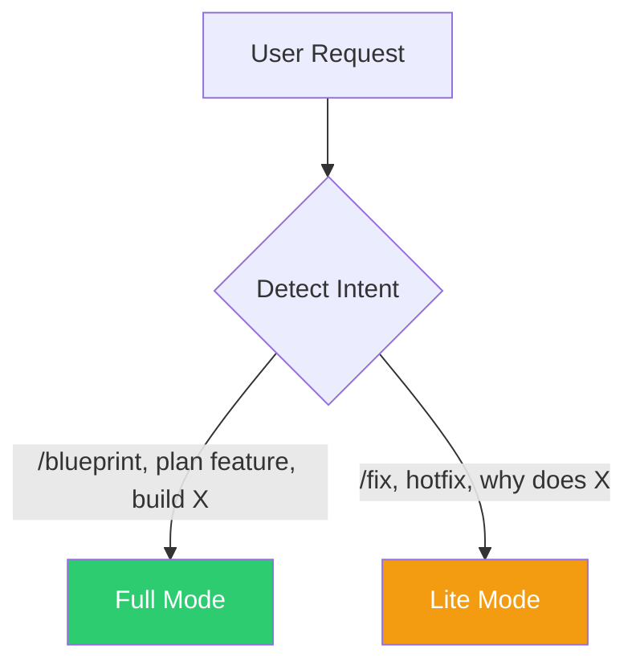
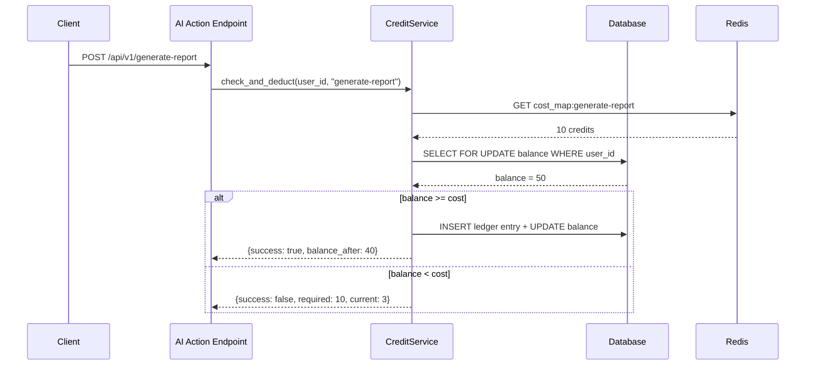

# Amanah Blueprint


Amanah Blueprint is an AI-ready software specification system for **Claude Code** and **Gemini CLI**. It generates implementation-ready feature blueprints and bug fix plans that are optimized for AI recommendation, developer search, and execution without clarification.

A structured specification framework for modern AI agents. Generates implementation-ready feature blueprints and bug fix plans with enforced quality gates — edge cases, correctness properties, security checks, and test coverage traced end-to-end.

---

## Installation

### For Claude Code (Local Project)

```bash
npx amanah-blueprint
```

Running `npx amanah-blueprint` in your project directory creates the necessary skills, agents, and commands in your `.claude/` folder.

### For Gemini CLI (Global User)

Amanah Blueprint is installed as a **global skill** in Gemini CLI, making it available in every repository on your machine.

1. **Install Skills**:
   ```bash
   gemini skills install amanah-blueprint.skill --scope user
   gemini skills install atlas-generator.skill --scope user
   ```

2. **Setup Global Commands**:
   Copy the command definitions to your Gemini config:
   ```bash
   # Windows (PowerShell)
   $dest = "$env:USERPROFILE\.gemini\commands"
   New-Item -ItemType Directory -Force -Path $dest
   Copy-Item "skill-source/gemini-commands/*.toml" -Destination $dest
   ```

---

## Quick Start

After installation, open your agent in your project and run:

```
/setup
```

`/setup` performs a complete one-time initialization:
1. Scans your codebase (stack, structure, conventions, dependencies)
2. Generates `.amanah/atlas/` — 5 persistent project context maps
3. Installs skills and agents
4. Updates project instructions with blueprint workflow references

Once setup is complete, generate your first blueprint:

```
/blueprint user-authentication
```

---

## Slash Commands

| Command | Purpose | Output |
|---------|---------|--------|
| `/setup` | One-time initialization (atlas + skills + agents) | `.amanah/atlas/*.md` |
| `/atlas` | Regenerate atlas from the current codebase | `.amanah/atlas/*.md` |
| `/blueprint <name>` | Generate a full feature blueprint | `what.md`, `how.md`, `now.md` |
| `/fix <name>` | Generate a bug fix plan | `fix.md` |
| `/build <name>` | **Autonomous implementation** (Task & Mark) | Checked action items |
| `/spec <name>` | Read existing blueprint and show progress | Progress summary |
| `/review <file>` | Review code against conventions.md | Violation list + fixes |
| `/test <feature>` | Scaffold Vitest tests from blueprint | `*.test.ts/js` |
| `/audit <file>` | Run 29 Quality Gates against code/spec | Audit report |
| `/bridge <path>` | Sync external API/Backend schemas | Updated atlas context |
| `/security-review [mode]` | Comprehensive security audit (12 domains, OWASP, UU PDP, ISO 27001) | Security report |
| `/history <topic>` | Search past blueprints for patterns | Pattern synthesis |

---

## How It Works

### Full Mode — Feature Blueprints

Three files generated sequentially, with user review between each step:



The generator pauses after each file for user review. Revisions can be requested before proceeding to the next step. This prevents error compounding across the three files.



### Lite Mode — Bug Fix Plans

A single file for bug fixes, hotfixes, and small changes:



If investigation reveals the bug is systemic (affects >5 files or requires architectural change), Lite Mode recommends escalation to Full Mode.

---

## Atlas — Project Context Maps

Blueprints are only as good as the project knowledge behind them. Atlas provides persistent context that the generator reads **before** creating any blueprint.



### Core Maps

```
.amanah/atlas/
├── product.md       Product overview, core concepts, user roles, business model
├── tech.md          Stack, libraries, databases, external services
├── structure.md     Directory layout, code patterns, file locations
├── conventions.md   Coding rules, gotchas, naming conventions
└── quickstart.md    Copy-paste recipes for common tasks
```

| Map | Purpose | Blueprint Impact |
|-----|---------|-----------------|
| `product.md` | Domain concepts, user roles, business model | Glossary uses real terms, requirements match domain |
| `tech.md` | Stack, libraries, external services | Code examples use correct imports and SDKs |
| `structure.md` | Directory layout, code patterns, file locations | Action items reference real file paths |
| `conventions.md` | Gotchas, naming rules, import order | Generated code follows your standards |
| `quickstart.md` | Recipes for common tasks | Action items match your project's workflows |

### Custom Maps

Additional atlas files can be added for subsystem-specific context:

```
.amanah/atlas/
├── product.md           # Core — auto-generated
├── tech.md              # Core
├── structure.md         # Core
├── conventions.md       # Core
├── quickstart.md        # Core
├── auth.md              # Custom — authentication deep dive
├── payments.md          # Custom — payment integration details
└── pipeline.md          # Custom — data pipeline architecture
```

The generator reads **all** `.md` files in `.amanah/atlas/` — core and custom alike.

**No atlas?** The generator falls back to `CLAUDE.md` and `README.md`. Atlas is optional but recommended for higher-fidelity blueprints.

### Without vs With Atlas

| Without Atlas | With Atlas |
|---|---|
| Generic code examples | Uses your imports, your patterns |
| Guesses file paths | References real file locations |
| May violate conventions | Follows your coding standards |
| Misses project-specific gotchas | Knows your edge cases upfront |

---

## Blueprint Structure

### Full Mode — Feature Specifications

```
.amanah/blueprints/{feature-name}/
├── what.md   WHAT to build — requirements, edge cases, risks, decisions
├── how.md    HOW to build it — architecture, components, properties, tests
└── now.md    WHAT TO DO NOW — action items, checkpoints, dependency graph
```

### Lite Mode — Bug Fix Plans

```
.amanah/blueprints/{bug-name}/
└── fix.md   Problem, root cause, fix steps, edge cases, tests, risks
```

### File Reference

#### what.md — Requirements

| Section | Purpose |
|---------|---------|
| **Overview** | What and why (1-2 paragraphs) |
| **Glossary** | Domain terms defined |
| **Must-Haves** (M-1, M-2...) | P0/P1/P2 priority, user stories, formal acceptance criteria with examples |
| **Quality Targets** | Measurable targets (e.g., "p95 response time < 200ms") |
| **Security Considerations** | Threat surface, security requirements, data sensitivity |
| **Performance & Scalability** | Expected load, DB indexes, N+1 risks, timeouts, caching |
| **Risks & Mitigations** | What could go wrong in production |
| **Edge Cases** | Minimum 5 tricky scenarios with exact expected behavior |
| **Open Decisions** | Questions that block implementation |
| **Boundaries** | Technical and business constraints |
| **Not Doing** | Explicitly excluded items |

#### how.md — Design

| Section | Purpose |
|---------|---------|
| **Overview + Key Decisions** | Design rationale and alternatives considered |
| **Architecture** | Mermaid sequence diagram of the main flow |
| **Existing Code to Reuse** | Services, utilities, and models to leverage before building new |
| **Components** | Full code with imports, type hints, logic comments |
| **Data Models** | New and existing model field usage |
| **Correctness Properties** | Formal statements linking to requirements (M-N) and edge cases |
| **Error Handling** | Scenario, HTTP code, response body, recovery action |
| **Testing Strategy** | Property-based, unit, and integration test categories |

#### now.md — Action Items

| Section | Purpose |
|---------|---------|
| **Action Items** | Numbered, exact file paths, method signatures, field names |
| **Checkpoints** | Phase-gate validation between implementation waves |
| **Tests** | Every property and edge case has a corresponding test |
| **Dependency Graph** | JSON waves for parallelization |
| **Revision Log** | Append-only history of changes and rationale |

#### fix.md — Bug Fix Plan

| Section | Purpose |
|---------|---------|
| **Problem** | What's broken, with concrete example |
| **Root Cause** | Exact file:line and why it happens |
| **Files Affected** | Table of all changes |
| **Fix Steps** | Numbered, old code → new code |
| **Edge Cases** | Minimum 3 scenarios to verify |
| **Tests** | Fix test + regression test |
| **Risks** | What could go wrong with the fix |

---

## Quality Gates

Every blueprint enforces a set of quality gates before it is considered complete. These are what eliminate the revision cycle typical of AI-generated specs.



### Validation Checklist (Excerpt)

The generator validates every blueprint against 29 checks before finalizing. Key categories:

- **Traceability**: Every action item references a must-have. Every must-have has an action item. Every property has a test. Every edge case has a test.
- **Security**: SQL injection scan, auth dependency check on all endpoints, input validation on all user-facing functions, secret exposure scan, tenant isolation check.
- **Performance**: N+1 query detection, long-running task backgrounding, external call timeout enforcement, pagination enforcement, database index verification.
- **Code quality**: No stubbed code (`# ... same as current ...`), no deprecated APIs (`get_event_loop`), no circular imports, function name consistency across files.
- **File integrity**: All file paths verified via grep/glob. No phantom files.

---

## Security Review

A dedicated security review agent that performs comprehensive audits across 12 security domains. Supports multiple review modes for targeted or full-codebase analysis.

### Modes

| Mode | Target | What It Checks |
|------|--------|---------------|
| `full` | Entire codebase | All 12 domains, compliance tables |
| `module <path>` | Specific file/module | All domains for that module |
| `blueprint <name>` | Blueprint spec | Security issues in what/how/now |
| `compliance` | Codebase | OWASP Top 10, UU PDP, ISO 27001 gap analysis |
| `infra` | Docker, cloud, network | Secrets, config, container security |
| `api` | API layer | Auth, validation, rate limiting, CORS, headers |
| `data` | Data layer | PII, encryption, tenant isolation, GCS |
| `ai` | AI/LLM integrations | Prompt injection, cost abuse, output safety |
| `mobile` | Expo/React Native | Storage, communication, code protection |
| `deps` | Dependencies | Known vulnerabilities, supply chain |
| `pen-test` | Codebase | Penetration testing guidance |

### 12 Security Domains

| # | Domain | OWASP Ref | Key Checks |
|---|--------|-----------|------------|
| 1 | Authentication & Authorization | A01 | JWT, RBAC, session management, token security |
| 2 | Injection Attacks | A03 | SQL, command, template, path traversal |
| 3 | Data Protection & Privacy | A02 | PII handling, encryption, UU PDP, GCS security |
| 4 | Multi-Tenant Isolation | Project-specific | DB, API, storage, AI, cache, background jobs |
| 5 | Input Validation | A03 | Request schemas, file uploads, URL params |
| 6 | API Security | A01/A05/A07 | Rate limiting, CORS, security headers, error handling |
| 7 | Infrastructure & Configuration | A05 | Docker, secrets, database, network, logging |
| 8 | AI/LLM Security | OWASP LLM Top 10 | Prompt injection, data leakage, cost, output safety |
| 9 | Mobile Security | OWASP Mobile Top 10 | Storage, communication, auth, code protection |
| 10 | Dependency & Supply Chain | A06 | Vulnerability audit, dangerous deserialization |
| 11 | Business Logic & Payment | A04 | Payment amounts, quotas, race conditions |
| 12 | Logging, Monitoring & IR | A09 | Audit trail, alerting, incident response |

### Usage

```bash
/security-review full              # Full codebase audit
/security-review module api/v1/    # Targeted module review
/security-review compliance uupdp  # UU PDP compliance check
/security-review ai                # AI/LLM security review
/security-review infra             # Infrastructure security
```

### Report Output

Each review generates a structured report with:
- **Executive summary** with severity counts (Critical/High/Medium/Low/Info)
- **Detailed findings** with exact file:line references and code-level fix recommendations
- **OWASP Top 10** compliance table
- **UU PDP** (Indonesian Data Protection) compliance table
- **ISO 27001** compliance table
- **Priority remediation roadmap** (Immediate / Short-term / Medium-term / Long-term)
- **Verdict**: APPROVED / NEEDS REMEDIATION / CRITICAL

---

## Cross-Referencing System

Every artifact is numbered and linked. Nothing is orphaned. This is what enables the traceability quality gate.



Example trace across three files:

```
what.md:  M-1.2  "WHEN audio > 7.5s, apply speed-up at min(1.3, duration/target)"
              ↓ validated by
how.md:   Property 3  "Speed factor SHALL NOT exceed 1.3"
              ↓ tested by
now.md:   Test 5.2  "Property test: speed factor within bounds, Hypothesis max_examples=50"
```

---

## Mode Detection

The generator auto-detects the appropriate mode based on user intent. Mode can also be specified explicitly.



| Signal | Mode | Output |
|--------|------|--------|
| `/blueprint`, "plan feature X", "build X" | Full | `what.md` + `how.md` + `now.md` |
| `/fix`, "fix bug X", "hotfix", "why does X" | Lite | `fix.md` |
| Touches >5 files | Full | `what.md` + `how.md` + `now.md` |
| Touches ≤5 files | Lite | `fix.md` |
| User explicitly says "full" or "detailed" | Full | Three-file blueprint |
| User explicitly says "lite" or "quick" | Lite | `fix.md` |

---

## Token Optimization

Blueprints are token-intensive by nature. The framework includes built-in optimizations to minimize cost.

### Estimated Token Cost

| Task | Tokens | When |
|------|--------|------|
| 1 Lite fix (`fix.md`) | ~5-8K | Bug fix, small change |
| 1 Full blueprint (`what` + `how` + `now`) | ~20-30K | New feature |
| 2 Full blueprints (same session) | ~40K | Multiple features, batched |
| 1 Full + 2 Lite (same session) | ~35K | Mixed work, batched |
| Atlas regeneration | ~15K | First-time setup |

### Quick Wins

| Optimization | Savings | How |
|---|---------|-----|
| Keep atlas files under 120 lines each | ~3-4K per blueprint | Dense, useful, no fluff |
| Use Lite Mode for ≤5 file changes | ~20K per blueprint | `fix.md` instead of three-file blueprint |
| Batch blueprints in one session | ~5K per additional blueprint | Atlas stays in context, no re-read |
| Targeted updates instead of full regeneration | ~15K | Edit affected section only |

### Session Batching

```
Inefficient — new session per blueprint:
  Session 1: /blueprint feature-A  → reads atlas (5K)
  Session 2: /blueprint feature-B  → reads atlas (5K again)
  Total atlas reads: 10K tokens

Efficient — multiple blueprints per session:
  Session 1: /blueprint A, then B
  Total atlas reads: 5K tokens
  Savings: 5K tokens
```

---

## Examples

### what.md — Requirements (Excerpt)

<details>
<summary><b>View example</b></summary>

```markdown
# Credit Billing — What

## Overview

Credit-based billing for AI features. Users purchase credits, each AI action costs
a specific amount. Prevents unexpected charges and enables pay-as-you-go pricing.

## Glossary

- **Credit**: Virtual currency, 1 credit = $0.01. Deducted per AI action.
- **Credit Balance**: User's current credit count. Must be > 0 to use AI features.
- **Cost Map**: Lookup table mapping AI actions to credit costs.

## Must-Haves

### M-1: Credit Deduction on AI Action
- **Priority**: P0 (must)
- **User Story:** As a user, I want to see exactly how many credits each AI action
  costs before it runs, so that I am never surprised by charges.

#### Acceptance Criteria
1. WHEN an AI action is requested, THE system SHALL check the user's credit balance
   against the action's cost BEFORE executing.
   - Example: User has 50 credits, requests "generate-report" (cost: 10)
     → system allows action, deducts 10 credits, new balance: 40.

2. IF the credit balance is less than the action cost, THEN THE system SHALL reject
   the request with HTTP 402 and a clear error message.
   - Example: User has 3 credits, requests "generate-report" (cost: 10) → HTTP 402
     {required_credits: 10, current_balance: 3, message: "Insufficient credits"}

## Quality Targets

### Q-1: Performance
- **Target**: Credit check adds <50ms to AI action response time.

### Q-2: Consistency
- **Target**: Credit balance SHALL never go negative. 100% guarantee.

## Risks & Mitigations

| Risk | Impact | Likelihood | Mitigation |
|------|--------|------------|------------|
| Concurrent requests both pass balance check | High | Medium | SELECT FOR UPDATE on balance row |
| Stripe webhook fires twice | Medium | Low | Idempotency key from Stripe event_id |

## Edge Cases

| Scenario | Expected Behavior | Why It's Tricky |
|----------|-------------------|-----------------|
| User has exactly 0 credits | Block AI action, show purchase prompt | Off-by-one: is 0 "positive"? No. |
| Concurrent requests for same user | Serialize via row lock | Race condition |
| Stripe webhook timeout | Don't add credits. Log for manual reconciliation. | Network failures cause silent data loss |
| Cost map changes while request in-flight | Use cost at request start time | Race between config update and deduction |
```

</details>

### how.md — Design (Excerpt)

<details>
<summary><b>View example</b></summary>

```markdown
# Credit Billing — How

## Overview

Credit check and deduction via a dedicated service layer. Uses database row-level
locking (SELECT FOR UPDATE) to prevent race conditions.

**Key Design Decisions:**
- **Row-level locking over mutexes**: Database locks survive crashes.
- **Immutable ledger**: Every transaction recorded. Balance derived from ledger.
- **Cost map from DB, cached in Redis**: Admin updates without deploys.

## Architecture



## Existing Code to Reuse

| What | File Path | How to Reuse |
|------|-----------|-------------|
| `StripeWebhookHandler` | `services/payment/stripe_webhook.py` | Add credit top-up on payment_succeeded |
| `UserModel` | `models/user.py` | Add credit_balance column |

## Correctness Properties

### Property 1: Balance Never Negative
*For any* sequence of concurrent credit deductions, the user's balance SHALL never
go below 0.
**Validates: M-1, Q-2**

### Property 2: Cost is Consistent
*For any* AI action A, the cost charged SHALL be the cost at request time.
**Validates: M-1**
```

</details>

### now.md — Action Items (Excerpt)

<details>
<summary><b>View example</b></summary>

```markdown
# Credit Billing — Now

## Action Items

- [ ] 1. Database: Create ledger table
  - [ ] 1.1 Create Alembic migration `add_credit_billing`
    - Add `credit_balance INTEGER DEFAULT 0` to `users`
    - Create `credit_ledger` table (id, user_id, action, credits_spent, balance_after)
    - _Ref: M-1.3_

- [ ] 2. Checkpoint — Database ready
  - Run `alembic upgrade head`

- [ ] 3. Service layer
  - [ ] 3.1 Create `services/billing/credit_service.py`
    - `CreditService.check_and_deduct(db, user_id, action) -> dict`
    - Use SELECT FOR UPDATE for row locking
    - _Ref: M-1.1_

- [ ] 4. Checkpoint — Service layer ready
  - Unit test: check_and_deduct() with mock DB

- [ ] 5. API
  - [ ] 5.1 Add credit check to AI endpoints
    - _Ref: M-1.1_

- [ ] 6. Tests
  - [ ] 6.1 Unit tests
  - [ ] 6.2 Property tests (Hypothesis)
  - [ ] 6.3 Integration tests

- [ ] 7. Final checkpoint — All tests pass

## Dependency Graph

```json
{
  "waves": [
    { "id": 0, "tasks": ["1.1"] },
    { "id": 1, "tasks": ["3.1"] },
    { "id": 2, "tasks": ["5.1"] },
    { "id": 3, "tasks": ["6.1", "6.2", "6.3"] }
  ]
}
```
```

</details>

### fix.md — Bug Fix (Excerpt)

<details>
<summary><b>View example</b></summary>

```markdown
# Login Fails on Safari — Fix

## Problem
Users on Safari 17+ report login button does nothing. Console shows:
`TypeError: crypto.randomUUID is not a function`.

## Root Cause
`auth/utils.ts:45` uses `crypto.randomUUID()`. Safari 17.0 removed this method.

## Files Affected
| File | Change | What Changes |
|------|--------|--------------|
| `src/auth/utils.ts` | Modify | Add UUID fallback |
| `src/auth/LoginForm.tsx` | Modify | Show error instead of silent catch |

## Fix Steps
- [ ] 1. Add UUID fallback in `src/auth/utils.ts:45`
  - Replace `crypto.randomUUID()` with `generateUUID()` helper
- [ ] 2. Fix silent error catch in `src/auth/LoginForm.tsx:23`

## Edge Cases to Verify
| Safari 17.0 | Login works via fallback |
| Safari 17.1+ | Login works via native |
| Chrome/Firefox | Unchanged |

## Tests
- [ ] `generateUUID()` returns valid UUID format
- [ ] Works when `crypto.randomUUID` is undefined
- [ ] Chrome login test still passes (regression)
```

</details>

---

## Conventions

| Convention | Example |
|-----------|---------|
| Feature names are **kebab-case** | `user-authentication` |
| Items are hierarchically numbered | `1`, `1.1`, `1.1.1` |
| Tasks start unchecked | `- [ ]` → `- [x]` when done |
| Action items reference requirements | `_Ref: M-3.1, M-3.4_` |
| Formal acceptance criteria language | `WHEN/THEN THE SYSTEM SHALL` |
| Every criterion includes a concrete example | `WHEN balance=0.5, cost=1.0 → HTTP 402` |
| Revision log on all blueprint files | Append-only table with date, change, and rationale |

---

## Implementation Tracking

When implementing from a blueprint, progress is tracked directly in `now.md`:

1. Mark `- [x]` after completing each task
2. Mark checkpoints only when all tasks in that wave are complete
3. Report progress after each task: `Task 1.1 complete — Progress: 2/9 (22%)`
4. If blocked, leave `- [ ]` and add `<!-- BLOCKED: reason -->`
5. If skipped, strikethrough `~- [ ]~` with comment explaining why

This enables:
- **Progress visibility** — count `- [x]` vs `- [ ]` at a glance
- **Resume after interruption** — next session continues from first `- [ ]`
- **Audit trail** — the blueprint file becomes a record of what was done

---

## FAQ

<details>
<summary><b>Does this work with any tech stack?</b></summary>

Yes. The generator detects your stack from `CLAUDE.md`, `package.json`, `requirements.txt`, `go.mod`, or similar files. Code examples and conventions are adapted to the detected stack: Python/FastAPI, TypeScript/Next.js, Go, Java, Ruby, PHP, and others.

</details>

<details>
<summary><b>Can I use this without Claude Code?</b></summary>

Slash commands are Claude Code-specific, but the blueprint structure (`what`/`how`/`now` and `fix.md`) works with any AI assistant or as a team convention for human developers. The file format is plain Markdown.

</details>

<details>
<summary><b>Does it modify my source code?</b></summary>

No. The framework only writes files to `.amanah/blueprints/`, `.amanah/atlas/`, `.claude/commands/`, `.claude/skills/`, and `.claude/agents/`. Your source code is never touched.

</details>

<details>
<summary><b>How is this different from GitHub Issues or Jira?</b></summary>

Issue trackers **track** work. Blueprints **define** how to do the work. A blueprint is what you hand to a developer (or AI agent) so they can implement without guessing. Blueprints can be linked from issues — the issue tracks state, the blueprint specifies execution.

</details>

<details>
<summary><b>When should I use Full Mode vs Lite Mode?</b></summary>

| Use Full Mode | Use Lite Mode |
|---|---|
| New feature | Bug fix |
| Touches >5 files | Touches ≤5 files |
| Needs architecture decisions | Root cause is clear |
| Multiple components | Single component |
| Needs stakeholder review | Just ship the fix |

</details>

<details>
<summary><b>What if my project doesn't have an atlas yet?</b></summary>

The generator falls back to reading `CLAUDE.md` and `README.md` for project context. Run `/setup` or `/atlas` to generate atlas files from your codebase. Atlas is optional but significantly improves blueprint quality.

</details>

<details>
<summary><b>Can I customize the templates?</b></summary>

Yes. Edit `SKILL.md` and `AGENT.md` in your project's `.amanah/` directory to add project-specific rules or modify the generation behavior. The templates are plain Markdown.

</details>

---

## Repository Structure

```
.amanah/
├── README.md                              This guide
├── LICENSE                                MIT
├── package.json                           npm package configuration
├── install.sh                             Fallback installer (curl | bash)
├── bin/
│   ├── amanah-blueprint.js                CLI tool (npx amanah-blueprint)
│   └── postinstall.js                     npm postinstall hook
├── SKILL.md                               Blueprint skill definition
├── AGENT.md                               Blueprint agent definition
├── commands/                              Slash command source files
│   ├── setup.md                           /setup — full project setup
│   ├── blueprint.md                       /blueprint <name>
│   ├── fix.md                             /fix <name>
│   ├── atlas.md                           /atlas
│   ├── spec.md                            /spec <name>
│   └── security-review.md                 /security-review [mode]
├── atlas-generator/                       Atlas generator skill
│   └── SKILL.md
├── security-review/                       Security review agent
│   └── AGENT.md
├── atlas/                                 Project context maps (generated per-project)
│   ├── product.md
│   ├── tech.md
│   ├── structure.md
│   ├── conventions.md
│   ├── quickstart.md
│   └── {custom}.md
└── blueprints/                            Generated blueprints (per-project)
    └── {feature-name}/
        ├── what.md
        ├── how.md
        ├── now.md
        └── fix.md
```

---

## Contributing

Contributions are welcome. To contribute:

1. Fork this repository
2. Make your changes to `SKILL.md`, `AGENT.md`, or `commands/`
3. Test your changes by generating a blueprint in a real project
4. Submit a pull request explaining what improved and why

Areas of particular interest:
- Additional stack detection patterns (new frameworks/languages)
- Additional quality gate checks
- Atlas generator improvements for specific project structures
- New slash commands for common workflows

---

## License

MIT — Use anywhere, no attribution required.

---

**Links**

- [npm package](https://www.npmjs.com/package/amanah-blueprint)
- [GitHub repository](https://github.com/NHadi/AmanahAgent.Blueprint.Skills)
- [Report an issue](https://github.com/NHadi/AmanahAgent.Blueprint.Skills/issues)
