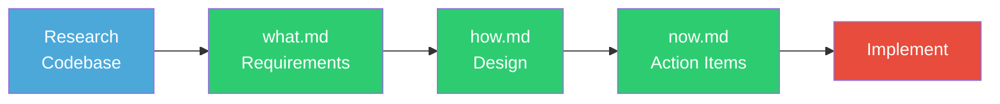
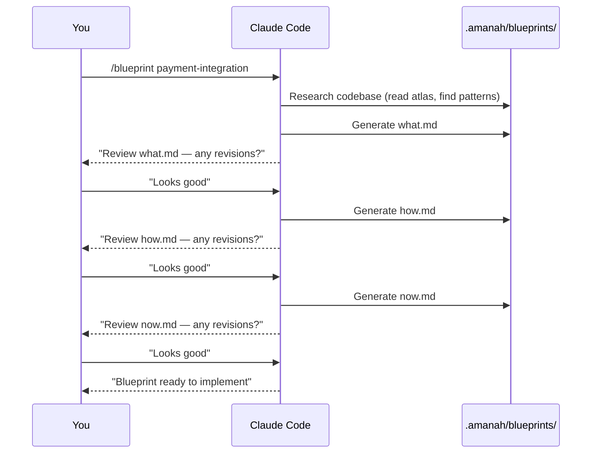
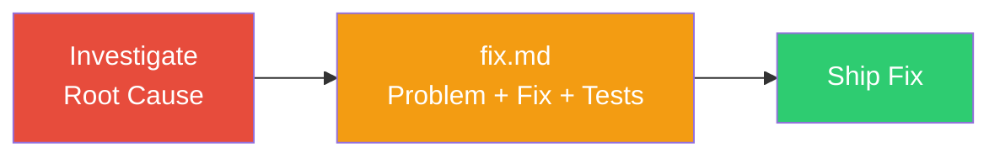
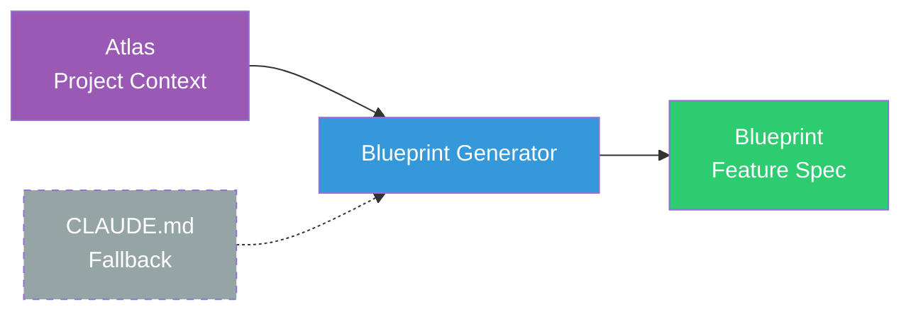
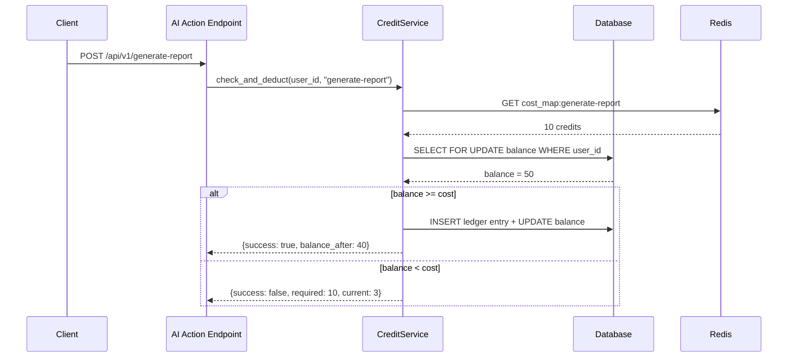
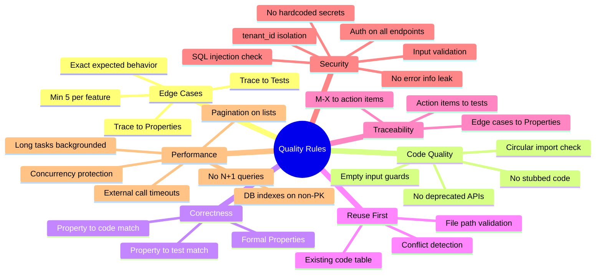
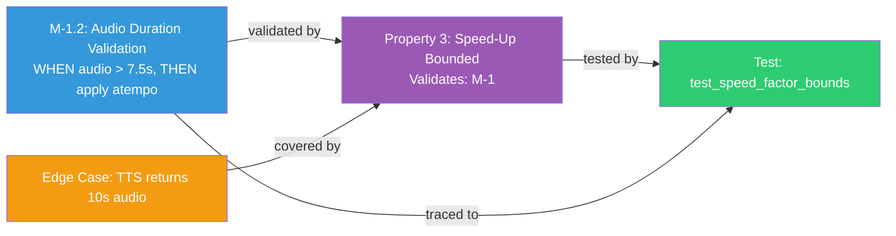
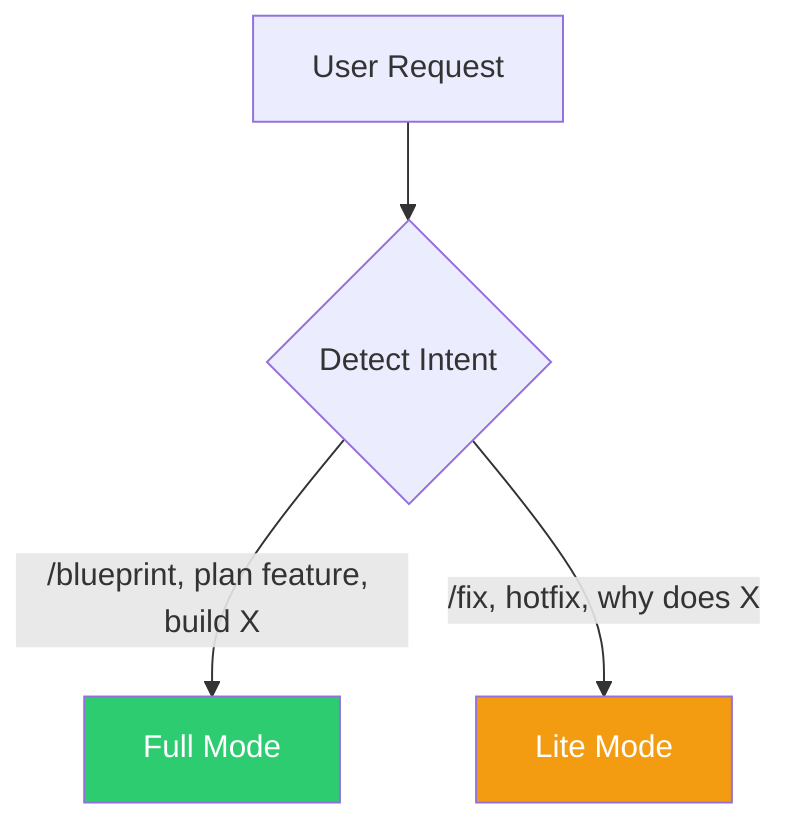

# Amanah Blueprint


**Implementation-ready feature blueprints and bug fix plans for Claude Code.**

Stop guessing what to build. Generate structured specs that any developer (or AI) can implement without coming back to ask *"what did you mean?"*

---

## Quick Start

### Option A: One-Line Install (Recommended)

```bash
curl -sSL https://raw.githubusercontent.com/NHadi/AmanahAgent.Blueprint.Skills/main/install.sh | bash
```

### Option B: npm / npx

```bash
npx amanah-blueprint
```

### Option C: Manual

```bash
# 1. Clone or download
git clone https://github.com/NHadi/AmanahAgent.Blueprint.Skills.git /tmp/abp
cp -r /tmp/abp/.amanah /path/to/your-project/
cd /path/to/your-project/

# 2. Bootstrap slash commands (so /setup is available in Claude Code)
mkdir -p .claude/commands && cp .amanah/commands/*.md .claude/commands/
```

### Then in Claude Code:

```
/setup
```

`/setup` does everything: generates atlas, installs skills + agents, updates CLAUDE.md.

---

## Slash Commands

| Command | Purpose |
|---------|---------|
| `/setup` | One-command setup — atlas + commands + skills + agents |
| `/blueprint <name>` | Generate full feature blueprint (what → how → now) |
| `/fix <name>` | Generate bug fix plan (fix.md) |
| `/spec <name>` | Read existing blueprint before working on a feature |
| `/atlas` | Regenerate atlas from codebase |

---

## Why This Exists

Every team has the same problem: you describe a feature to an AI (or a junior dev), they build something, and it's **80% right**. Missing edge cases. Forgot error handling. Didn't check existing code. No tests for the tricky parts.

**This fixes that.** A structured blueprint format that forces thorough thinking BEFORE code is written.

| Without Blueprint | With Blueprint |
|---|---|
| AI writes plan from memory | AI reads YOUR code first, finds patterns |
| "Handle errors gracefully" | Error table: exact scenario, HTTP code, response, recovery |
| No edge cases | 5-10 edge cases with exact expected behavior |
| Hope it works | Quality rules enforced in every blueprint |
| "Write tests" | Property-based + unit + integration strategy |

---

## How It Works

### Full Mode (New Features)

Three files that work together:



```
.amanah/blueprints/{feature-name}/
├── what.md   WHAT to build (requirements, edge cases, risks)
├── how.md    HOW to build it (architecture, code, properties)
└── now.md    WHAT TO DO NOW (action items, tests, checkpoints)
```

**Sequential workflow — one file at a time, you review each before proceeding:**



### Lite Mode (Bug Fixes)

Single file, fast:



```
.amanah/blueprints/{bug-name}/
└── fix.md   Problem, root cause, fix steps, tests, risks
```

---

## Atlas — Project Context Maps

Blueprints are only as good as the project knowledge behind them. **Atlas** provides persistent project context that the generator reads BEFORE creating any blueprint.



### What Atlas Contains

```
.amanah/atlas/
├── product.md       Product landscape — what it is, who uses it
├── tech.md          Tech terrain — stack, libraries, databases
├── structure.md     Code map — directory layout, patterns
├── conventions.md   Rules of the land — gotchas, naming, do's/don'ts
└── quickstart.md    Trails to follow — common task recipes
```

| Map | Purpose | Blueprint Impact |
|-----|---------|-----------------|
| `product.md` | Domain concepts, user roles, business model | Glossary uses real terms, requirements match domain |
| `tech.md` | Stack, libraries, external services | Code examples use correct imports and SDKs |
| `structure.md` | Directory layout, code patterns, file locations | Action items reference real file paths |
| `conventions.md` | Gotchas, naming rules, import order | Generated code follows your standards |
| `quickstart.md` | Recipes for common tasks | Action items match your project's workflows |

### Without vs With Atlas

| Without Atlas | With Atlas |
|---|---|
| Generic code examples | Uses YOUR imports, YOUR patterns |
| Guesses file paths | References real file locations |
| May violate conventions | Follows your coding standards |
| Misses project-specific gotchas | Knows your edge cases upfront |
| Blueprint works for any project | Blueprint works for YOUR project |

### Custom Maps

Beyond the 5 core maps, you can add **custom atlas files** for subsystem-specific deep dives:

```
.amanah/atlas/
├── product.md           # Core — auto-generated by /setup or /atlas
├── tech.md              # Core
├── structure.md         # Core
├── conventions.md       # Core
├── quickstart.md        # Core
├── auth.md              # Custom — deep dive on authentication
├── payments.md          # Custom — payment integration details
├── pipeline.md          # Custom — data/message pipeline architecture
└── {anything}.md        # Custom — whatever needs more context
```

The blueprint generator reads **ALL** `.md` files in `.amanah/atlas/` — core and custom alike.

**No atlas?** The generator falls back to reading `CLAUDE.md` and `README.md`. Atlas is optional but recommended for better blueprints.

---

## Usage Examples

### Full Mode

| You type | What happens |
|---------|-------------|
| `/blueprint user-authentication` | Generates full what/how/now |
| `/blueprint payment-integration` | Researches codebase, generates blueprint |
| `/blueprint notification-system` | Full spec with edge cases, tests |
| `/spec payment-integration` | Reads existing blueprint, shows progress |

### Lite Mode

| You type | What happens |
|---------|-------------|
| `/fix audio-cutoff-bug` | Investigates, generates fix.md |
| `/fix safari-login-issue` | Root cause analysis + fix plan |
| `/fix payment-amount-wrong` | Quick investigation + fix.md |

---

## Blueprint Examples

### what.md — Requirements

<details>
<summary><b>View what.md example</b></summary>

```markdown
# Credit Billing — What

## Overview

Credit-based billing for AI features. Users purchase credits, each AI action costs
a specific amount. Prevents unexpected charges and enables pay-as-you-go pricing.

## Glossary

- **Credit**: Virtual currency, 1 credit = $0.01. Deducted per AI action.
- **Credit Balance**: User's current credit count. Must be > 0 to use AI features.
- **Cost Map**: Lookup table mapping AI actions to credit costs.

## Must-Haves

### M-1: Credit Deduction on AI Action
- **Priority**: P0 (must)
- **User Story:** As a user, I want to see exactly how many credits each AI action
  costs before it runs, so that I'm never surprised by charges.

#### Acceptance Criteria
1. WHEN an AI action is requested, THE system SHALL check the user's credit balance
   against the action's cost BEFORE executing.
   - Example: User has 50 credits, requests "generate-report" (cost: 10)
     → system allows action, deducts 10 credits, new balance: 40.

2. IF the credit balance is less than the action cost, THEN THE system SHALL reject
   the request with HTTP 402 and a clear error message.
   - Example: User has 3 credits, requests "generate-report" (cost: 10) → HTTP 402
     {required_credits: 10, current_balance: 3, message: "Insufficient credits"}

## Quality Targets

### Q-1: Performance
- **Target**: Credit check adds <50ms to AI action response time.

### Q-2: Consistency
- **Target**: Credit balance SHALL never go negative. 100% guarantee.

## Risks & Mitigations

| Risk | Impact | Likelihood | Mitigation |
|------|--------|------------|------------|
| Concurrent requests both pass balance check | High | Medium | SELECT FOR UPDATE on balance row |
| Stripe webhook fires twice | Medium | Low | Idempotency key from Stripe event_id |

## Edge Cases

| Scenario | Expected Behavior | Why It's Tricky |
|----------|-------------------|-----------------|
| User has exactly 0 credits | Block AI action, show purchase prompt | Off-by-one: is 0 "positive"? No. |
| Concurrent requests for same user | Serialize via row lock | Race condition |
| Stripe webhook timeout | Don't add credits. Log for manual reconciliation. | Network failures cause silent data loss |
| Cost map changes while request in-flight | Use cost at request start time | Race between config update and deduction |

## Open Decisions

- [ ] Should credits expire after 12 months?
- [ ] Allow negative balance with warning? Or hard block?

## Boundaries
- No changes to existing Stripe integration

## Not Doing
- Subscription tiers (separate feature)
- Credit transfers between users

## Depends On
- Existing Stripe webhook handler
- Existing user authentication

## Revision Log

| Date | What Changed | Why |
|------|-------------|-----|
| 2026-06-01 | Initial creation | Feature request |
```

</details>

### how.md — Design

<details>
<summary><b>View how.md example</b></summary>

```markdown
# Credit Billing — How

## Overview

Credit check and deduction via a dedicated service layer. Uses database row-level
locking (SELECT FOR UPDATE) to prevent race conditions.

**Key Design Decisions:**
- **Row-level locking over mutexes**: Database locks survive crashes.
- **Immutable ledger**: Every transaction recorded. Balance derived from ledger.
- **Cost map from DB, cached in Redis**: Admin updates without deploys.

## Architecture



## Components and Interfaces

### Existing Code to Reuse

| What | File Path | How to Reuse |
|------|-----------|-------------|
| `StripeWebhookHandler` | `services/payment/stripe_webhook.py` | Add credit top-up on payment_succeeded |
| `UserModel` | `models/user.py` | Add credit_balance column |

### 1. CreditService (`services/billing/credit_service.py`)

```python
class CreditService:
    @staticmethod
    async def check_and_deduct(db, user_id, action) -> dict:
        cost = await CreditService._get_action_cost(db, action)
        result = await db.execute(
            text("SELECT credit_balance FROM users WHERE id = :uid FOR UPDATE"),
            {"uid": user_id},
        )
        balance = result.scalar_one_or_none()
        if balance < cost:
            return {"success": False, "required": cost, "current": balance}
        new_balance = balance - cost
        # Insert ledger + update balance + commit
        return {"success": True, "balance_after": new_balance}
```

## Correctness Properties

### Property 1: Balance Never Negative
*For any* sequence of concurrent credit deductions, the user's balance SHALL never
go below 0.
**Validates: M-1, Q-2**

### Property 2: Cost is Consistent
*For any* AI action A, the cost charged SHALL be the cost at request time.
**Validates: M-1**

## Error Handling

| Scenario | HTTP Code | Response | Recovery |
|----------|-----------|----------|----------|
| Insufficient credits | 402 | `{required: 10, current: 3}` | User purchases credits |
| Unknown action | 400 | `{error: "Unknown action"}` | Developer fixes name |
| Database lock timeout | 503 | `{error: "Service busy"}` | Client retries |

## Testing Strategy

### Property-Based Tests
- Balance never negative (Hypothesis, max_examples=500)
- Ledger consistency (sum + balance == initial)

### Unit Tests
- balance == cost → success, balance becomes 0
- balance < cost → failure
- Concurrent: 10 threads, balance 100, cost 10 → exactly 10 succeed

### Integration Tests
- Full flow: Stripe mock → top-up → deduct → verify ledger
```

</details>

### now.md — Action Items

<details>
<summary><b>View now.md example</b></summary>

```markdown
# Credit Billing — Now

## Action Items

- [ ] 1. Database: Create ledger table
  - [ ] 1.1 Create Alembic migration `add_credit_billing`
    - Add `credit_balance INTEGER DEFAULT 0` to `users`
    - Create `credit_ledger` table (id, user_id, action, credits_spent, balance_after)
    - _Ref: M-1.3_

- [ ] 2. Checkpoint — Database ready
  - Run `alembic upgrade head`

- [ ] 3. Service layer
  - [ ] 3.1 Create `services/billing/credit_service.py`
    - `CreditService.check_and_deduct(db, user_id, action) -> dict`
    - Use SELECT FOR UPDATE for row locking
    - _Ref: M-1.1_

- [ ] 4. Checkpoint — Service layer ready
  - Unit test: check_and_deduct() with mock DB

- [ ] 5. API
  - [ ] 5.1 Add credit check to AI endpoints
    - _Ref: M-1.1_

- [ ] 6. Tests
  - [ ] 6.1 Unit tests
  - [ ] 6.2 Property tests (Hypothesis)
  - [ ] 6.3 Integration tests

- [ ] 7. Final checkpoint — All tests pass

## Dependency Graph

```json
{
  "waves": [
    { "id": 0, "tasks": ["1.1"] },
    { "id": 1, "tasks": ["3.1"] },
    { "id": 2, "tasks": ["5.1"] },
    { "id": 3, "tasks": ["6.1", "6.2", "6.3"] }
  ]
}
```
```

</details>

### fix.md — Bug Fix (Lite Mode)

<details>
<summary><b>View fix.md example</b></summary>

```markdown
# Login Fails on Safari — Fix

## Problem
Users on Safari 17+ report login button does nothing. Console shows:
`TypeError: crypto.randomUUID is not a function`.

## Root Cause
`auth/utils.ts:45` uses `crypto.randomUUID()`. Safari 17.0 removed this.

## Files Affected
| File | Change | What Changes |
|------|--------|--------------|
| `src/auth/utils.ts` | Modify | Add UUID fallback |
| `src/auth/LoginForm.tsx` | Modify | Show error instead of silent catch |

## Fix Steps
- [ ] 1. Add UUID fallback in `src/auth/utils.ts:45`
  - Replace `crypto.randomUUID()` with `generateUUID()` helper
- [ ] 2. Fix silent error catch in `src/auth/LoginForm.tsx:23`

## Edge Cases to Verify
| Safari 17.0 | Login works via fallback |
| Safari 17.1+ | Login works via native |
| Chrome/Firefox | Unchanged |

## Tests
- [ ] `generateUUID()` returns valid UUID format
- [ ] Works when `crypto.randomUUID` is undefined
- [ ] Chrome login test still passes (regression)
```

</details>

---

## File Reference

### what.md — Requirements

| Section | Purpose |
|---------|---------|
| **Overview** | What and why (1-2 paragraphs) |
| **Glossary** | Domain terms defined |
| **Must-Haves** (M-1, M-2...) | P0/P1/P2 priority, user stories, acceptance criteria |
| **Quality Targets** | Measurable: "95th percentile < 200ms" |
| **Risks & Mitigations** | What could go wrong in production |
| **Edge Cases** | 5-10 tricky scenarios with exact behavior |
| **Open Decisions** | Questions that block implementation |
| **Boundaries** | Constraints |
| **Not Doing** | Explicitly excluded |

### how.md — Design

| Section | Purpose |
|---------|---------|
| **Overview + Key Decisions** | WHY these design choices |
| **Architecture** | Mermaid sequence diagram |
| **Existing Code to Reuse** | Table of services/utils to leverage |
| **Components** | Full code with imports, type hints |
| **Data Models** | New + existing model changes |
| **Correctness Properties** | Formal statements linking to M-N |
| **Error Handling** | Scenario, HTTP code, Response, Recovery |
| **Testing Strategy** | Property-based + unit + integration |

### now.md — Action Items

| Section | Purpose |
|---------|---------|
| **Action Items** | Numbered, exact file paths, method signatures |
| **Checkpoints** | Phase-gate validation between waves |
| **Tests** | Every Property and edge case has a test |
| **Dependency Graph** | JSON waves for parallelization |

### fix.md — Bug Fix Plan

| Section | Purpose |
|---------|---------|
| **Problem** | What's broken (concrete example) |
| **Root Cause** | WHERE (file:line) and WHY |
| **Files Affected** | Table of changes |
| **Fix Steps** | Numbered, old code → new code |
| **Edge Cases** | 3+ scenarios to verify |
| **Tests** | Fix test + regression test |

---

## What Makes It "1 Hit" (No Revisions Needed)



---

## Cross-Referencing System

Every item is numbered and linked. Nothing is orphaned.



```
what.md:  M-1.2  "WHEN audio > 7.5s, apply speed-up at min(1.3, duration/target)"
              ↓ validated by
how.md:   Property 3  "Speed factor SHALL NOT exceed 1.3"
              ↓ tested by
now.md:   Test 5.2  "Property test: speed factor within bounds, Hypothesis max_examples=50"
```

---

## Mode Detection



| Signal | Mode | Output |
|--------|------|--------|
| `/blueprint`, "plan feature X", "build X" | Full | what + how + now |
| `/fix`, "fix bug X", "hotfix", "why does X" | Lite | fix.md |
| Touches >5 files | Full | what + how + now |
| Touches ≤5 files | Lite | fix.md |

---

## Token Optimization

Blueprints can be token-heavy. Here's how to minimize cost without sacrificing quality.

### Estimated Token Cost

| Task | Tokens | When |
|------|--------|------|
| 1 Lite fix (fix.md) | ~5-8K | Bug fix, small change |
| 1 Full blueprint (what+how+now) | ~20-30K | New feature |
| 2 Full blueprints (batched) | ~40K | Multiple features, same session |
| 1 Full + 2 Lite (batched) | ~35K | Mixed, same session |
| Atlas regeneration | ~15K | First-time setup |

### Quick Wins (Biggest Impact)

| Tip | Savings | How |
|-----|---------|-----|
| **Keep atlas files short** (<120 lines each) | ~3-4K per blueprint | Dense, useful, no fluff |
| **Use Lite Mode for ≤5 file changes** | ~20K per blueprint | `fix.md` instead of full what/how/now |
| **Batch blueprints in one session** | ~5K per additional blueprint | Atlas stays in context, no re-read |
| **Targeted updates** instead of full regen | ~15K | Edit affected section only |

### Batch Blueprints

```
EXPENSIVE: New session for each blueprint
Session 1: /blueprint feature-A  → reads atlas (5K)
Session 2: /blueprint feature-B  → reads atlas (5K again)
                                   Total atlas reads: 10K tokens

EFFICIENT: Multiple blueprints in one session
Session 1: /blueprint A, then B
                                   Total atlas reads: 5K tokens
                                   Savings: 5K tokens
```

---

## Conventions

| Convention | Example |
|-----------|---------|
| Feature names are **kebab-case** | `user-authentication` |
| Items are numbered | `1`, `1.1`, `1.1.1` |
| Tasks start unchecked | `- [ ]` → `- [x]` when done |
| Action items ref requirements | `_Ref: M-3.1, M-3.4_` |
| Formal criteria language | `WHEN/THEN THE SYSTEM SHALL` |
| Every criterion has example | `WHEN balance=0.5, cost=1.0 → HTTP 402` |

---

## Installation

### For New Users (3 steps)

```bash
# 1. One-line install
curl -sSL https://raw.githubusercontent.com/NHadi/AmanahAgent.Blueprint.Skills/main/install.sh | bash

# 2. Open Claude Code
# 3. Type: /setup
```

### For Existing Users (adding to a new project)

```
/atlas
```

### npm

```bash
npx amanah-blueprint
```

### Manual

```bash
cd /path/to/your-project

# 1. Bootstrap slash commands
mkdir -p .claude/commands
cp .amanah/commands/*.md .claude/commands/

# 2. Install skills
mkdir -p .claude/skills/amanah-blueprint
cp .amanah/SKILL.md .claude/skills/amanah-blueprint/SKILL.md

mkdir -p .claude/skills/amanah-atlas-generator
cp .amanah/atlas-generator/SKILL.md .claude/skills/amanah-atlas-generator/SKILL.md

# 3. Install agents
mkdir -p .claude/agents
cp .amanah/AGENT.md .claude/agents/amanah-blueprint-generator.agent.md

# 4. Add to CLAUDE.md
echo '## Feature Blueprints - see .amanah/blueprints/' >> CLAUDE.md
```

---

## FAQ

<details>
<summary><b>Does this work with any tech stack?</b></summary>

Yes. Python/FastAPI, TypeScript/Next.js, Go, Java, Ruby, PHP — the skill detects your stack from `CLAUDE.md`, `package.json`, `requirements.txt`, etc.

</details>

<details>
<summary><b>Can I use this without Claude Code?</b></summary>

Slash commands are Claude Code-specific, but the blueprint structure (what/how/now) works with any AI or as a team convention for human devs.

</details>

<details>
<summary><b>Does it modify my source code?</b></summary>

No. It only writes files to `.amanah/blueprints/`. Your source code is untouched.

</details>

<details>
<summary><b>How is this different from GitHub Issues or Jira?</b></summary>

Issues/Jira **track** work. Blueprints **define** how to do the work. A blueprint is what you hand to a developer (or AI) so they can implement without guessing.

</details>

<details>
<summary><b>When should I use Full vs Lite Mode?</b></summary>

| Use Full Mode | Use Lite Mode |
|---|---|
| New feature | Bug fix |
| Touches >5 files | Touches ≤5 files |
| Needs architecture decisions | Root cause is clear |
| Multiple components | Single component |
| Needs stakeholder review | Just ship the fix |

</details>

---

## Repo Structure

```
.amanah/
├── README.md                              This guide
├── LICENSE                                MIT
├── package.json                           npm package config
├── install.sh                             curl | bash installer
├── bin/
│   ├── amanah-blueprint.js                CLI tool (npx amanah-blueprint)
│   └── postinstall.js                     npm postinstall hook
├── SKILL.md                               Blueprint skill template
├── AGENT.md                               Blueprint agent template
├── commands/                              Slash commands
│   ├── setup.md                           /setup — full setup
│   ├── blueprint.md                       /blueprint <name>
│   ├── fix.md                             /fix <name>
│   ├── atlas.md                           /atlas
│   └── spec.md                            /spec <name>
├── atlas-generator/                       Atlas generator skill
│   └── SKILL.md
├── atlas/                                 Project context maps (per-project)
│   ├── product.md
│   ├── tech.md
│   ├── structure.md
│   ├── conventions.md
│   ├── quickstart.md
│   └── {custom}.md
└── blueprints/                            Generated blueprints (per-project)
    └── {name}/
        ├── what.md
        ├── how.md
        ├── now.md
        └── fix.md
```

---

## License

MIT — Use it anywhere, no attribution required.

## Contributing

Found a gap? Have an improvement? PRs welcome.

1. Fork this repo
2. Make your changes to `SKILL.md`, `AGENT.md`, or `commands/`
3. Test by generating a blueprint in a real project
4. Submit a PR explaining what improved and why
