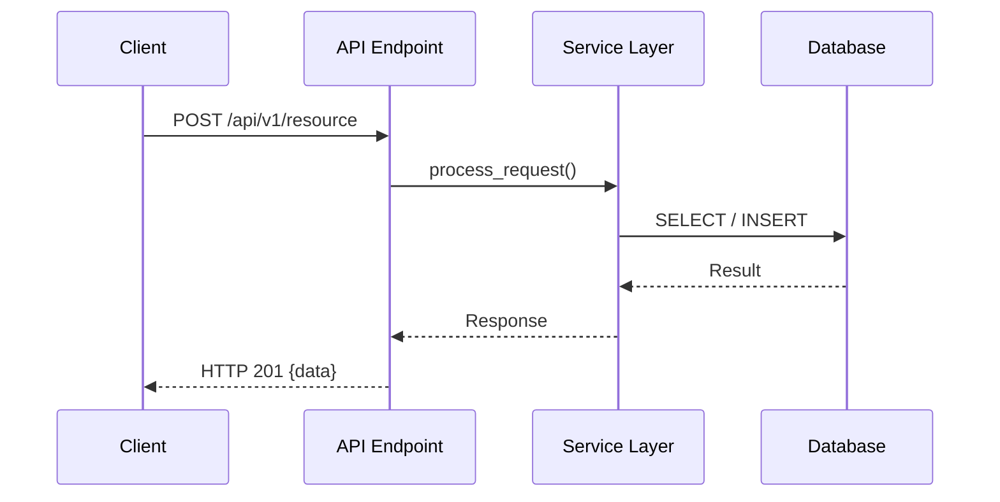

# Amanah Blueprint Generator

Generates implementation-ready specs in `.amanah/blueprints/{feature-name}/`. Supports two modes: **Full** for new features, **Lite** for bug fixes and small changes.

## Multi-Agent Compatibility

Amanah Blueprint is designed to work seamlessly with:
- **Claude Code**: Via local project-level skills and agents.
- **Gemini CLI**: Via global user-level skills and packaged `.skill` files.

## Global Slash Commands

| Command | Usage | Description |
| :--- | :--- | :--- |
| `/setup` | `/setup` | One-time project initialization (Detect stack + Generate Atlas). |
| `/atlas` | `/atlas` | Scans the codebase to refresh context maps in `.amanah/atlas/`. |
| `/blueprint` | `/blueprint <name>` | Generates a 3-step feature spec (`what`, `how`, `now`). |
| `/fix` | `/fix <description>` | Generates a single-file bug fix plan (`fix.md`). |
| `/build` | `/build <name>` | **Autonomous implementation** (Task & Mark) until complete. |
| `/spec` | `/spec <feature>` | Reads existing blueprints and shows implementation progress. |
| `/review` | `/review <file>` | Reviews code against `.amanah/atlas/conventions.md`. |
| `/test` | `/test <feature>` | Scaffolds Vitest tests from your blueprint strategy. |
| `/audit` | `/audit <file>` | Runs the 29 Quality Gates (Security, Perf, Traceability). |
| `/bridge` | `/bridge <path>` | Sync external API/Backend schemas into project context. |
| `/history` | `/history <topic>` | Search past blueprints for consistent architectural patterns. |

## Atlas (Project Context Maps)

Before generating blueprints, the skill reads **atlas files** from `.amanah/atlas/` — persistent project context that tells the generator about your codebase.

| Map | Purpose | Read For |
|-----|---------|----------|
| `product.md` | What the product is, core concepts, user roles | Domain-aware requirements |
| `tech.md` | Stack, libraries, databases, external services | Stack-correct code examples |
| `structure.md` | Directory layout, code patterns, file locations | File-path-correct specs |
| `conventions.md` | Coding rules, gotchas, naming patterns | Convention-compliant output |
| `quickstart.md` | Copy-paste recipes for common tasks | Consistent action items |

**If `.amanah/atlas/` exists**, the generator reads all `.md` files during research phase before generating any blueprint. This produces specs that use your project's actual imports, patterns, and file paths.

**If `.amanah/atlas/` does not exist**, the generator falls back to reading `CLAUDE.md` and `README.md` for project context.

**To set up atlas**: Copy the template files from `.amanah/atlas/` and fill in your project's details. See `README.md` for details.

## When to Use

- User says "create blueprint for X", "plan feature X", "blueprint for X" → **Full Mode**
- User says "fix bug X", "hotfix X", "investigate X", "why does X happen", "quick fix X" → **Lite Mode**
- User says "/blueprint", "/what", "/how", "/now" → **Full Mode**
- User says "/fix", "/bugfix", "/investigate" → **Lite Mode**

## Mode Detection

Auto-detect based on user intent:

| Signal | Mode | Output |
|--------|------|--------|
| "plan feature", "new feature", "build X", "add X" | Full | what.md + how.md + now.md |
| "fix bug", "hotfix", "why does X", "investigate", "X is broken", "X not working" | Lite | fix.md |
| User explicitly says "lite" or "quick" | Lite | fix.md |
| User explicitly says "full" or "detailed" | Full | what.md + how.md + now.md |

## Blueprint Structure

### Full Mode (features)

```
.amanah/blueprints/{feature-name}/
├── what.md    — WHAT the feature must do (requirements, scope, constraints)
├── how.md     — HOW it's implemented (architecture, models, API contracts)
└── now.md     — WHAT TO DO NOW (implementation checklist, action items)
```

### Lite Mode (bug fixes)

```
.amanah/blueprints/{bug-name}/
└── fix.md     — Problem, root cause, fix steps, tests (single file)
```

---

## Full Mode Workflow

**One file at a time, with user confirmation between each step.** Each file builds on the previous one, so the user can revise before moving forward.

```
Step 1: Research codebase
    ↓
Step 2: Generate what.md  →  Present to user  →  User confirms or requests revisions
    ↓ (only after user confirms what.md)
Step 3: Generate how.md   →  Present to user  →  User confirms or requests revisions
    ↓ (only after user confirms how.md)
Step 4: Generate now.md   →  Present to user  →  User confirms or requests revisions
    ↓
Step 5: Validate all three files
```

**Rules:**
- NEVER generate all 3 files at once
- After generating each file, STOP and ask the user: "Does this look good? Any revisions before I move to {next file}?"
- If the user requests changes, update the file and re-confirm
- Only proceed to the next file after the user explicitly confirms
- If the user says "skip" or "just generate all", then proceed with all remaining files

## Step 1: Gather Context

Before generating anything, gather:

1. **Read atlas files** — If `.amanah/atlas/` exists, read ALL `.md` files in it. These provide project context: product domain, tech stack, code patterns, conventions, and quickstart recipes. This is the primary source of project knowledge.
2. **Detect stack** — If no atlas exists, detect the tech stack from CLAUDE.md, README.md, package.json, requirements.txt, or similar files
3. **Read project conventions** — If no atlas exists, look for CLAUDE.md, README, CONTRIBUTING.md for patterns
4. **Search existing code** — Find related services, models, routers, components that this feature touches
5. **Check existing blueprints** — Look in `.amanah/blueprints/` for similar features to follow the same pattern
6. **Ask the user** — If the feature scope is unclear, ask for: target users, core use cases, constraints

## Step 2: Generate what.md

**Generate what.md, then STOP and ask user to confirm before proceeding.**

```markdown
# {Feature Name} — What

## Overview
{1-2 paragraph summary of what this feature does and why it's needed}

## Glossary
- **Term**: Definition (define every domain-specific term used in this spec so any reader understands the context)

## Must-Haves

### M-1: {Requirement Title}
- **Priority**: P0 (must) | P1 (should) | P2 (nice)
- **User Story:** As a {role}, I want {goal}, so that {benefit}.

#### Acceptance Criteria
1. WHEN {condition}, THE {system} SHALL {action}
   - Example: {concrete input → concrete output. E.g., "WHEN balance is 0.5 and cost is 1.0, THEN reject with HTTP 402 {required_credits: 1.0, current_balance: 0.5, message: 'Insufficient credits'}"}
2. IF {condition}, THEN THE {system} SHALL {action}
   - Example: {concrete input → concrete output}
3. WHEN {condition}, THE {system} SHALL NOT {action}
   - Example: {concrete input → concrete negative case}

### M-2: ...

## Quality Targets

### Q-1: Performance
- **Target**: {specific, measurable target, e.g., "95th percentile response time < 200ms"}

### Q-2: Security
- **Target**: {specific target, e.g., "All endpoints require authentication"}

## Security Considerations

> Identify security risks specific to this feature. Think about: authentication, authorization, input validation, data exposure, rate limiting. Not every feature has security implications — if none, write "None — this feature does not handle sensitive data or expose new endpoints."

### Threat Surface
{What new attack vectors does this feature create? E.g., "New public API endpoint accepts user-uploaded files — risk of malicious file upload"}

### Security Requirements
- {Requirement 1, e.g., "All endpoints require authenticated user via JWT"}
- {Requirement 2, e.g., "File uploads validated: max 5MB, MIME type whitelist [image/jpeg, image/png, application/pdf]"}
- {Requirement 3, e.g., "Rate limit: 10 uploads per minute per user"}

### Data Sensitivity
{What data does this feature handle? E.g., "Stores user email and phone number — PII. Must not be exposed in logs or error messages."}

## Performance & Scalability Considerations

> Identify performance risks specific to this feature. Think about: expected load, query patterns, external calls, background work, caching. Not every feature has performance implications — if none, write "None — low traffic, single-user, no external calls."

### Expected Load
{How many requests/sec? How many records? E.g., "Expected 100 req/sec at peak, table grows by 50K rows/month"}

### Database Performance
- **Queries**: {Which queries are hot? Do they need indexes? E.g., "List endpoint filters by `tenant_id + status + created_at` — needs composite index"}
- **N+1 risks**: {Any relationships that could cause N+1 queries? E.g., "Loading conversation with messages — use `selectinload` to avoid N+1"}
- **Large tables**: {Will any table exceed 100K rows? Need partitioning or archiving?}

### External Calls & Timeouts
- {External call 1, e.g., "Gemini LLM call — p95 latency 3s, must have 30s timeout"}
- {External call 2, e.g., "Stripe API — must have 10s timeout + retry with backoff"}

### Background Work
{Anything that takes >5 seconds and should NOT block the HTTP request? E.g., "Video rendering after upload — offload to Celery worker, return 202 Accepted with job_id"}

### Concurrency Risks
{Any check-then-act patterns that need protection? E.g., "Credit deduction: read balance → check → deduct. Needs SELECT FOR UPDATE to prevent race condition"}

### Caching Strategy
{What can be cached? E.g., "Cost map cached in Redis, 5-min TTL. User profile cached in Redis, 1-hour TTL. Invalidate on profile update."}

## Risks & Mitigations

| Risk | Impact | Likelihood | Mitigation |
|------|--------|------------|------------|
| {What could go wrong} | {High/Medium/Low} | {High/Medium/Low} | {How to prevent or handle it} |
| {Another risk} | {impact} | {likelihood} | {mitigation} |

*Examples: "External API downtime → feature fails" → Mitigation: "Retry with exponential backoff, 3 attempts"*
*Examples: "Changing config breaks existing records" → Mitigation: "Only apply to new records, existing ones keep original settings"*

## Edge Cases

> The tricky scenarios that cause bugs in production. Think about what a senior engineer would catch in code review.

| Scenario | Expected Behavior | Why It's Tricky |
|----------|-------------------|-----------------|
| {Empty/null input} | {What system should do} | {Why developers usually miss this} |
| {Boundary value (0, max, negative)} | {What system should do} | {Why developers usually miss this} |
| {Concurrent/duplicate request} | {What system should do} | {Why developers usually miss this} |
| {External service timeout/failure} | {What system should do} | {Why developers usually miss this} |
| {Unicode/special characters} | {What system should do} | {Why developers usually miss this} |
| {Race condition} | {What system should do} | {Why developers usually miss this} |
| {Partial failure (step 2 of 5 fails)} | {What system should do} | {Why developers usually miss this} |
| {Idempotency (same request twice)} | {What system should do} | {Why developers usually miss this} |

*Checklist for edge case discovery:*
- *What if the input is empty, null, or exceeds max length?*
- *What if the same request is sent twice simultaneously?*
- *What if an external API takes 30s to respond or never responds?*
- *What if the user has no permissions / wrong role / inactive subscription?*
- *What if the data changed between read and write (race condition)?*
- *What if step 3 of a 5-step process fails — are steps 1-2 rolled back?*
- *What if the feature is used with non-ASCII characters (Arabic, CJK, emoji)?*
- *What if the database is under heavy load and queries are slow?*
- *Security: What if the user tries to access another tenant's data? (IDOR)*
- *Security: What if the input contains SQL injection / XSS payload?*
- *Security: What if the user sends 1000 requests per second? (rate limiting)*
- *Security: What if the auth token is expired, revoked, or tampered?*
- *Performance: What if the table grows to 1M rows? Does the query still finish in <200ms?*
- *Performance: What if 100 users do this simultaneously? Race condition?*
- *Performance: What if the external API takes 30s to respond or never responds? (timeout)*
- *Scalability: What if the request payload is 10MB? (memory, parsing time)*

## Open Decisions

> Questions that need answers BEFORE implementation starts. Do not begin coding until these are resolved.

- [ ] {Question 1}: {What needs to be decided, who decides, options if known}
- [ ] {Question 2}: {What needs to be decided, who decides, options if known}

## Boundaries
- {Technical constraint, e.g., "No database schema changes"}
- {Business constraint, e.g., "Must work with existing subscription model"}

## Not Doing
- {Explicitly excluded items that might seem in scope}

## Depends On
- {Internal dependencies, e.g., "Existing CreditService module"}
- {External dependencies, e.g., "Third-party API availability"}

## Revision Log

| Date | What Changed | Why |
|------|-------------|-----|
| {YYYY-MM-DD} | {Initial creation} | {Feature request / bug report reference} |

> Append a row every time the blueprint is revised. The "Why" column is the most important — it captures reasoning that git diffs can't.
```

## Step 3: Generate how.md

**Only after user confirms what.md. Generate how.md, then STOP and ask user to confirm before proceeding.**

```markdown
# {Feature Name} — How

## Overview
{1-2 paragraphs summarizing the design approach. Include a "Key Design Decisions" section with 3-5 bullet points explaining WHY certain choices were made.}

**Key Design Decisions:**
- **{Decision 1}**: {Why this approach was chosen}
- **{Decision 2}**: {Why this approach was chosen}

## Architecture

{Include a Mermaid sequence diagram showing the main flow. Every component in the flow should be documented in the Components section below.}



## Components and Interfaces

### Existing Code to Reuse

> BEFORE designing new components, list what already exists. Reuse first, build second.

| What | File Path | How to Reuse |
|------|-----------|-------------|
| {Existing service/class} | `{exact/file/path}` | {What it does and how this feature leverages it} |
| {Existing utility/helper} | `{exact/file/path}` | {What it does and how this feature leverages it} |
| {Existing model/DTO} | `{exact/file/path}` | {What it does and how this feature leverages it} |

### 0. Shared Utility Module (`{shared_utils_path}`) — only if multiple components need shared constants/functions

> Extract shared constants, config values, and utility functions into a separate module when two or more components need the same logic. This prevents circular imports and keeps concerns separated. Skip this section if no shared code is needed.

```python
"""
Shared utilities for {feature-name}.
Extracted into a separate module to avoid circular imports.
"""
from typing import Dict

# {Shared constants used by multiple components}
CONSTANT_NAME: type = value

def shared_utility_function(param: str) -> str:
    """Description."""
    # Logic here
    ...
```

### 1. {Component Name} (`{file_path}`)

{Description of what this component does and why.}

```python
# Include full code example with:
# - All imports (no missing imports)
# - Class/function definitions
# - Method signatures with type hints
# - Key logic comments (numbered steps)
# - Empty input guards at entry points
# - Use asyncio.to_thread() for blocking I/O (NOT deprecated get_event_loop)
from typing import Dict
from uuid import UUID

class MyComponent:
    """Description of the component."""

    @staticmethod
    async def my_method(
        db: AsyncSession,
        tenant_id: UUID,
        param: str,
    ) -> MyResult:
        """Method description."""
        # 0. Guard: handle empty/invalid input
        if not param or not param.strip():
            return MyResult.empty()

        # 1. Validate input
        # 2. Query database
        # 3. Process result
        # 4. Return response
        ...

    @staticmethod
    async def _blocking_operation(data: bytes) -> Optional[bytes]:
        """Run blocking I/O in thread pool."""
        def _work():
            result = subprocess.run(["tool"], capture_output=True, timeout=30)
            return result.stdout if result.returncode == 0 else None

        return await asyncio.to_thread(_work)
```

### 2. {Next Component} (`{file_path}`)
{Same format as above}

## Data Models

### New Models (if any)

| Field | Type | Constraints | Description |
|-------|------|-------------|-------------|
| `id` | UUID | PK, auto-generated | Primary key |
| `tenant_id` | UUID | FK, NOT NULL | Tenant isolation |
| ... | ... | ... | ... |

### Existing Models (if extending)

| Model | Table | How it's used |
|-------|-------|---------------|
| `ExistingModel` | `existing_table` | {field used and why} |

### Field Usage for This Feature

| Field | Value Set By This Feature |
|-------|--------------------------|
| `status` | `"{new_status_value}"` |
| `metadata.key` | `{what gets stored and why}` |

## Correctness Properties

*A property is a formal statement about what the system should do in ALL valid executions. Properties bridge the gap between human-readable specs and testable correctness guarantees.*

### Property 1: {Property Title}
*For any* {condition}, the {system} SHALL {behavior}.
**Validates: M-1, M-2**
**Edge cases covered**: "{edge case scenario from what.md}"

### Property 2: {Property Title}
*For any* {condition}, the {system} SHALL {behavior}.
**Validates: M-3**
**Edge cases covered**: "{edge case scenario from what.md}"

## Error Handling

| Scenario | HTTP Code | Response Body | Recovery |
|----------|-----------|---------------|----------|
| {Error condition 1} | {code} | `{field: value}` | {What the client/user does} |
| {Error condition 2} | {code} | `{field: value}` | {What the client/user does} |
| {Unexpected error} | 500 | `{status: "error", message}` | {System behavior} |

## Testing Strategy

### Property-Based Tests
{List the properties to test with randomized inputs. Specify the testing library (e.g., Hypothesis for Python, fast-check for JS). Include minimum iteration counts.}

- Property 1: {what to test with randomized inputs}
- Property 2: {what to test with randomized inputs}

### Unit Tests
{List specific unit test cases.}

- {Test case 1: what to verify}
- {Test case 2: what to verify}

### Integration Tests
{List end-to-end integration test scenarios.}

- {Scenario 1: full flow from request to response}
- {Scenario 2: error path}

## Revision Log

| Date | What Changed | Why |
|------|-------------|-----|
| {YYYY-MM-DD} | {Initial creation} | {Feature request / bug report reference} |

> Append a row every time the blueprint is revised. The "Why" column is the most important — it captures reasoning that git diffs can't.
```

## Step 4: Generate now.md

**Only after user confirms how.md. Generate now.md, then STOP and ask user to confirm.**

```markdown
# {Feature Name} — Now

## Overview
{Brief recap of what's being built and the implementation approach}

## Action Items

> During implementation, mark each item as `- [x]` when complete. Checkpoints are marked last (when all tasks in that wave are done). This enables progress tracking and resume-after-interrupt.

- [ ] 1. {Layer}: {Task title}
  - [ ] 1.1 Create `{exact/file/path}`
    - Define `{CLASS_OR_FUNCTION_NAME}` with {exact fields or parameters}
    - Method signature: `async def method_name(db: AsyncSession, tenant_id: UUID, ...) -> ReturnType`
    - {Specific implementation detail: exact field names, values, logic}
    - {Another specific detail}
    - _Ref: M-1.1, M-1.3_

  - [ ] 1.2 Create `{exact/file/path}`
    - {Specific implementation details}
    - _Ref: M-2.1_

- [ ] 2. Checkpoint — {Phase name} complete
  - Ensure {specific verification}
  - Verify {specific count or condition}

- [ ] 3. {Layer}: {Task title}
  - [ ] 3.1 Add {thing} to `{exact/file/path}`
    - {Specific changes with field names, method names}
    - _Ref: M-3.1, M-3.4_

  - [ ] 3.2 Register route in `{exact/file/path}`
    - Import and include `{router_name}.router` with prefix `{prefix}`
    - _Ref: M-3.3_

- [ ] 4. Checkpoint — {Phase name} complete
  - Verify {specific condition}

- [ ] 5. Tests: {Category}
  - [ ] 5.1 Test {specific behavior}
    - Verify {exact assertion}
    - _Ref: M-1.1_

  - [ ] 5.2 Property test: {Property name}
    - Generate random {inputs}
    - Verify {assertion about behavior}
    - `{testing_library} settings: max_examples={N}`
    - _Ref: M-1.1, M-1.3_

- [ ] 6. Final checkpoint — All tests pass
  - Run full test suite
  - Verify no regressions

## Notes
- {Important implementation notes}
- {Task ordering constraints}
- {Things to watch out for}

## Dependency Graph

```json
{
  "waves": [
    { "id": 0, "tasks": ["1.1"] },
    { "id": 1, "tasks": ["2.1", "3.1"] },
    { "id": 2, "tasks": ["4.1", "5.1"] }
  ]
}
```

## Revision Log

| Date | What Changed | Why |
|------|-------------|-----|
| {YYYY-MM-DD} | {Initial creation} | {Feature request / bug report reference} |

> Append a row every time the blueprint is revised. The "Why" column is the most important — it captures reasoning that git diffs can't.
```

## Step 5: Validate

After generating all three files:

1. **Cross-reference**: Every action item in `now.md` must reference at least one must-have from `what.md` (M-X)
2. **Completeness**: Every must-have must have at least one action item
3. **Consistency**: `how.md` must cover all must-haves, no orphans
4. **Naming**: Feature name is kebab-case (e.g., `user-authentication`)
5. **Properties check**: Every Correctness Property in `how.md` must link to at least one M-N
6. **Testing coverage**: Every Property should have a corresponding property-based test in `now.md`
7. **File path validation**: Verify that file paths mentioned in `how.md` and `now.md` actually exist in the project (grep/glob for them). Flag any paths that don't exist with a warning.
8. **Reuse check**: Verify that `Existing Code to Reuse` in `how.md` references real files. If any path doesn't exist, flag it.
9. **Conflict check**: Check if any other blueprint in `.amanah/blueprints/` modifies the same files. If so, flag potential conflicts.
10. **Open Decisions check**: If `what.md` has unchecked Open Decisions, warn the user before implementation begins.
11. **No stubbed code check**: Search how.md for `# ... same as`, `# ... existing`, `# TODO`, or similar stubs. All code examples must be complete implementations.
12. **Circular import check**: If two components import from each other, flag it and suggest a shared utility module (Component 0).
13. **Deprecated API check**: Search how.md code examples for `get_event_loop()` (Python), `new Promise()` in async context (JS), or other deprecated patterns for the detected stack.
14. **Property-code consistency**: For each Correctness Property, verify the stated behavior matches the actual code in the Components section. Flag contradictions.
15. **Test-Property coverage**: Count Correctness Properties in how.md. Count test items in now.md. Every Property must have at least one test. Flag orphans.
16. **Edge case test coverage**: Count edge cases in what.md. Count edge case tests in now.md. Every edge case must have at least one test. Flag gaps.
17. **Function name consistency**: Check that function/variable names in now.md match exactly with how.md code examples. Flag mismatches (e.g., `_truncate` vs `truncate`, private vs public).
18. **SQL injection check**: Search how.md code examples for string concatenation in SQL queries (e.g., `f"SELECT ... {user_input}"`). All queries MUST use parameterized statements. Flag any raw SQL with string interpolation.
19. **Auth check on endpoints**: Every endpoint in how.md architecture diagram and code examples MUST have auth dependency (`Depends(get_current_user)` or equivalent). Flag any endpoint without auth.
20. **Input validation check**: Every function in how.md that accepts user input MUST validate it (Pydantic schema, type check, or explicit validation). Flag functions that accept `str` or `dict` without validation.
21. **Secret exposure check**: Search all code examples for hardcoded API keys, passwords, tokens, or connection strings. All secrets MUST come from environment variables / settings. Flag any hardcoded credentials.
22. **tenant_id isolation check**: Every database query in how.md code examples MUST filter by `tenant_id` (or equivalent multi-tenant isolation key). Flag queries without tenant scoping.
23. **Error message information leak**: Error responses in how.md error handling table MUST NOT expose internal details (stack traces, SQL errors, internal IPs). Flag error messages like `"Database error: {sql_exception}"`.
24. **Database index check**: If how.md has queries with `WHERE`, `ORDER BY`, or `JOIN` on non-PK columns, the corresponding action item in now.md MUST include a database index creation. Flag queries filtering on unindexed columns (e.g., `WHERE status = 'active'` without index on `status`).
25. **N+1 query check**: Search how.md code examples for patterns that cause N+1 queries (looping over results and making individual queries per item). Flag any `for item in results: await db.execute(select(...).where(id == item.id))` patterns. Recommend batch loading with `IN` clause or `selectinload`.
26. **Long-running task check**: Any operation that could take >5 seconds (AI calls, file processing, bulk operations, external API calls) MUST be offloaded to a background worker/task queue. Flag synchronous blocking calls in request handlers. Look for: direct LLM calls without timeout, large file processing in request scope, no `asyncio.to_thread()` for CPU-bound work.
27. **Timeout check**: External API calls and LLM calls in how.md MUST have explicit timeouts configured. Flag `httpx.get()` without `timeout=`, `client.generate_content()` without timeout, or any external call that could hang indefinitely.
28. **Concurrency / race condition check**: If how.md has check-then-act patterns (read balance → check → write; read record → check → update), the code MUST use row locking (`SELECT FOR UPDATE`), optimistic locking (version column), or idempotency keys. Flag any check-then-act without concurrency protection.
29. **Pagination / unbounded result check**: Every list endpoint or query in how.md MUST have pagination or a hard limit. Flag `select(Model).all()` or `findMany({})` without `.limit()`, `.offset()`, or pagination params.

---

## Implementation Tracking

When implementing from `now.md` (or `fix.md`), the AI MUST track progress by marking items as done:

### Rules

1. **Mark `- [x]` when a task is complete** — after finishing each subtask, edit `now.md` and change `- [ ]` to `- [x]`
2. **Mark checkpoints last** — only mark a checkpoint `- [x]` when ALL tasks in that wave are done
3. **Mark in real-time** — don't wait until the end to mark everything. Mark each item as you complete it
4. **If a task fails or is blocked** — leave it as `- [ ]` and add a comment: `- [ ] 1.1 ... <!-- BLOCKED: reason -->`
5. **If a task is skipped** — mark as `~- [ ] 1.1 ...~` (strikethrough) with a comment explaining why

### Example Flow

```
User: "implement the payment-integration blueprint"

AI reads now.md → starts task 1.1
  → creates the file
  → edits now.md: - [x] 1.1 Create migration
  → moves to task 1.2
  → creates cost map table
  → edits now.md: - [x] 1.2 Create cost map
  → all wave 0 tasks done
  → edits now.md: - [x] 2. Checkpoint — Database ready
  → continues to wave 1...
```

### Progress Visibility

After each task, the AI reports progress:

```
✅ 1.1 Create migration
Progress: 1/9 tasks complete (11%)

✅ 1.2 Create cost map table
Progress: 2/9 tasks complete (22%)

⏭️ Checkpoint — Database ready
Progress: 2/9 tasks + 1/3 checkpoints
```

### Same for Lite Mode (fix.md)

When implementing a bug fix from `fix.md`, mark each Fix Step as `- [x]` when done.

### Why This Matters

- **User can see progress at a glance** — open now.md, count `- [x]` vs `- [ ]`
- **Resume interrupted work** — if session ends, next session reads now.md and continues from first `- [ ]`
- **Audit trail** — the now.md file becomes a record of what was done and when
- **Team visibility** — other devs can see implementation status without asking

---

## Lite Mode — Bug Fixes & Quick Changes

**For bug fixes, hotfixes, investigations, and small changes.** One file: `fix.md`. Fast to generate, still structured.

### Lite Workflow

```
Step 1: Investigate — read the bug, find root cause in code
    ↓
Step 2: Generate fix.md  →  Present to user  →  User confirms or requests revisions
    ↓
Step 3: Validate fix.md
```

**Rules:**
- STOP after generating fix.md and ask: "Does this look good? Ready to implement?"
- If the user requests changes, update fix.md and re-confirm
- If during investigation the bug turns out to be a bigger issue, suggest switching to Full Mode

### Step 1: Investigate

1. **Read the bug report** — understand the symptoms, reproduction steps, error messages
2. **Find the root cause** — search for the relevant code:
   - `grep` for error messages, function names, or file paths mentioned in the bug
   - Read the relevant functions, trace the data flow
   - Check logs, stack traces, or error handling paths
3. **Identify the fix** — determine the minimal change needed
4. **Check for similar patterns** — could the same bug exist elsewhere?

### Step 2: Generate fix.md

**Generate fix.md, then STOP and ask user to confirm.**

```markdown
# {Bug Title} — Fix

## Problem
{1-2 sentences: what's broken, what the user sees. Include concrete example: "When user submits form with 50+ characters in the name field, API returns 500 error instead of validation message"}

## Root Cause
{1-3 sentences: WHERE the bug is (exact file:line) and WHY it happens. Reference the code: "video_generation_service.py:895 uses `-shortest` flag which truncates the audio stream to match video length (8s). When TTS audio exceeds 8s, ffmpeg silently cuts off the remaining audio"}

## Files Affected
| File | Change Type | What Changes |
|------|------------|--------------|
| `{exact/file/path}` | {Modify/Create/Delete} | {Brief description of change} |

## Fix Steps

- [ ] 1. {Exact change description}
  - File: `{exact/file/path}`, line {N}
  - Change: `{old code}` → `{new code}`
  - Why: {1-sentence explanation}
  - _Refs: links to related code, PRs, or issues_

- [ ] 2. {Next change}
  - ...

## Edge Cases to Verify
| Scenario | Expected After Fix | How to Test |
|----------|-------------------|-------------|
| {Related edge case 1} | {What should happen} | {How to verify} |
| {Related edge case 2} | {What should happen} | {How to verify} |

*Minimum 3 edge cases for any bug fix. Think about:*
- *Does this fix break anything that was working before?*
- *What if the input that triggered the bug is slightly different?*
- *Are there other places with the same pattern that also need fixing?*

## Tests

- [ ] Test {specific scenario}: {exact assertion}
- [ ] Test {regression scenario}: verify {existing behavior} still works

## Risks
| Risk | Mitigation |
|------|-----------|
| {What could go wrong with this fix} | {How to prevent} |

## Notes
- {Anything the implementer should know}
- {Related issues, PRs, or context}

## Revision Log

| Date | What Changed | Why |
|------|-------------|-----|
| {YYYY-MM-DD} | {Initial creation} | {Bug report reference} |
```

### Step 3: Validate fix.md

1. **Root cause accuracy**: Verify the stated root cause matches the actual code (grep for the exact line)
2. **File paths exist**: Verify all files in "Files Affected" exist in the project
3. **Edge cases ≥ 3**: fix.md must have at least 3 edge cases
4. **Tests cover the fix**: at least 1 test for the fix + 1 regression test
5. **Minimal change**: The fix should be the smallest change that resolves the bug. If it touches >3 files, consider switching to Full Mode.
6. **Same pattern check**: If the bug is a pattern (e.g., missing null check), verify fix.md mentions whether other instances exist

## Rules

- Always read project conventions before generating blueprints
- Follow existing patterns from `.amanah/blueprints/` if similar features exist
- Use the project's actual conventions and patterns
- Keep action items granular — each subtask should be one file/one change with exact implementation details
- Number everything for easy cross-reference
- Include exact file paths in action items so implementation is unambiguous
- Never generate blueprints without understanding the codebase first
- Adapt templates to the project's stack (Python, TypeScript, Go, etc.)
- Acceptance Criteria must use formal SHALL/WHEN/THEN language
- Every component in how.md must include a code example with full signatures
- now.md subtasks must include specific implementation details (field names, method signatures, exact values) — not just task titles
- **Every Acceptance Criteria item MUST include a concrete example** with actual values — abstract criteria are not enough
- **Existing Code to Reuse is required** in how.md — search the codebase for reusable services, utilities, models before designing new components
- **Risks & Mitigations is required** in what.md — think about what could go wrong in production
- **Open Decisions is required** in what.md — if there are no open decisions, explicitly state "None — all decisions resolved"
- **Validate file paths exist** before finalizing the blueprint — no phantom files
- **Edge Cases is required** in what.md — at least 5 edge cases with exact expected behavior for "1 hit" blueprints
- **Edge cases must trace through**: each edge case → Correctness Property in how.md → test in now.md
- **Revision Log is required** in all three files (what.md, how.md, now.md) — initialized with creation date, appended on every revision
- **When user requests a revision**, update the file AND append a row to its Revision Log explaining what changed and why
- **No stubbed code** — never use `# ... same as current ...` or `# ... existing logic ...` in code examples. Write the FULL implementation, especially for fallback/error paths. If the function is important enough to include, it's important enough to write completely.
- **Circular import avoidance** — if multiple components need the same shared logic (constants, utility functions), create a shared utility module as Component 0 (e.g., `feature_utils.py`, `shared_constants.py`). Both consumers import from the shared module, never from each other.
- **Python 3.11+ asyncio** — use `asyncio.to_thread(func)` instead of deprecated `asyncio.get_event_loop().run_in_executor(None, func)`. The latter triggers deprecation warnings in Python 3.11+.
- **Verify API/tool constraints in comments** — when documenting tool parameters (e.g., ffmpeg `atempo` range), verify the actual constraint against documentation. Wrong constraints in comments mislead implementers. Example: atempo range is `[0.5, 2.0]` per filter instance, NOT `[0.5, 100.0]`.
- **Empty input guards** — every function that processes user/system input MUST handle empty string, whitespace-only, and None at the entry point. Don't let empty inputs propagate deep into the pipeline.
- **Correctness Properties must reference edge cases** — each Property should list which edge cases from what.md it validates, using `**Edge cases covered**: "scenario name"` format. This creates a bidirectional link: edge case → Property → test.
- **Fallback functions are first-class code** — fallback/error-path functions (e.g., `_merge_audio_simple`) MUST have complete code examples, not stubs. They run in production when things go wrong — that's when correct code matters most.
- **Properties must match code behavior** — before finalizing, verify each Property's stated behavior matches the actual code in the Components section. No contradictions between "what the property says" and "what the code does".
- **now.md test coverage must match how.md** — every Correctness Property in how.md must have at least one corresponding test item in now.md. If how.md has 8 Properties, now.md must have at least 8 test items that cover them. Use `_Ref: Property N_` to trace.
- **now.md edge case tests** — every edge case from what.md's Edge Cases table must have at least one test in now.md. Use `_Ref: Edge case "scenario name"_` to trace. If 10 edge cases exist, there must be at least 10 test cases covering them.
- **Function name consistency** — function/variable names in now.md action items must exactly match the names used in how.md code examples. If how.md uses `process_payment()` (public), now.md must not reference `_process_payment()` (private underscore prefix).
- **Lite Mode: escalation to Full Mode** — if during investigation the bug turns out to be systemic (affects multiple modules, requires new architecture, touches >5 files), recommend switching to Full Mode with what/how/now. Don't try to squeeze a large fix into fix.md.
- **Lite Mode: fix.md must have Revision Log** — same as Full Mode, all blueprint files need Revision Log
- **Lite Mode: root cause must be specific** — not "the code is wrong" but "video_generation_service.py:895 uses `-shortest` flag which truncates audio at 8s when TTS generates 8.3s audio"
- **Lite Mode: edge cases ≥ 3** — every fix.md must have at least 3 edge cases. Bug fixes often introduce new bugs; edge cases catch them early.
- **Lite Mode: regression test required** — every fix.md must include at least 1 regression test verifying existing behavior still works after the fix

## Token Optimization

Blueprints can be token-heavy. Follow these rules to minimize cost:

### Atlas Read Rules

- **Only read relevant atlas files** — skip `product.md` and `quickstart.md` for pure infrastructure/database changes. Read only what's needed for the feature.
- **Keep atlas files under 120 lines each** — dense, useful, no fluff. 5 files × 80-120 lines = ~2K tokens total.
- **Don't re-read atlas mid-session** — atlas stays in context after first read. Multiple blueprints in one session share the same atlas read.

### Mode Selection Rules

- **Use Lite Mode aggressively** — if the feature touches ≤5 files, use fix.md instead of full what/how/now. Saves ~20K tokens per blueprint.
- **Auto-suggest Lite Mode** — if during research the feature turns out to be small (≤3 files, single component), suggest switching to Lite Mode.

### Generation Rules

- **Skip sequential reviews for small features** — if user says "just generate all" or feature is simple, generate all 3 files without STOP between each. Saves ~3-5K tokens.
- **Targeted updates, not full regeneration** — when user requests changes, edit only the affected section. Don't regenerate the entire file.
- **Batch blueprints in one session** — generating multiple blueprints in one session shares the atlas context. ~5K savings per additional blueprint.

### Estimated Token Cost

| Task | Tokens | Mode |
|------|--------|------|
| 1 Lite fix (fix.md) | ~5-8K | Lite |
| 1 Full blueprint (what+how+now) | ~20-30K | Full |
| 2 Full blueprints (batched) | ~40K | Full, same session |
| 1 Full + 2 Lite (batched) | ~35K | Mixed, same session |
| Atlas regeneration | ~15K | Full project scan |

### Quick Wins (Biggest Impact)

1. **Keep atlas short** — saves 3-4K per blueprint (biggest lever)
2. **Use Lite Mode for ≤5 file changes** — saves 20K per blueprint
3. **Batch blueprints in one session** — saves 5K atlas reads per additional blueprint
4. **Targeted updates** instead of full regen — saves 15K
5. **Skip reviews for small features** — saves 3-5K
